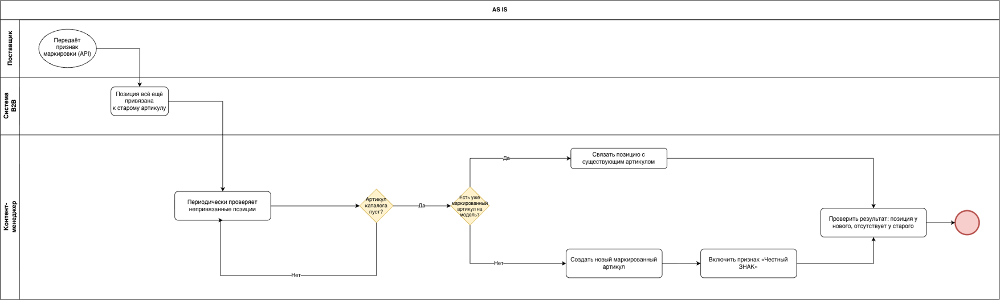
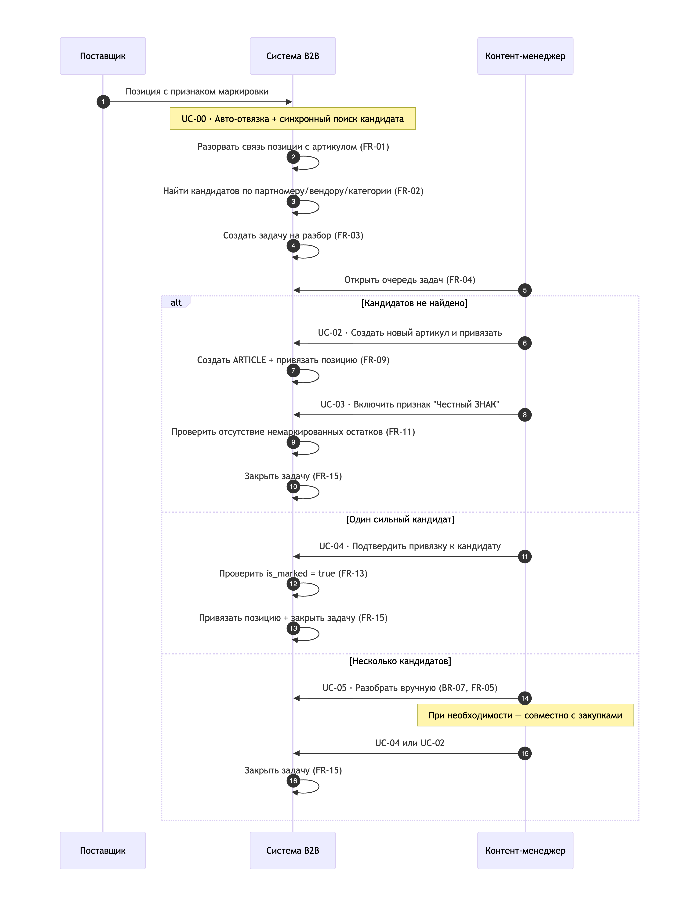
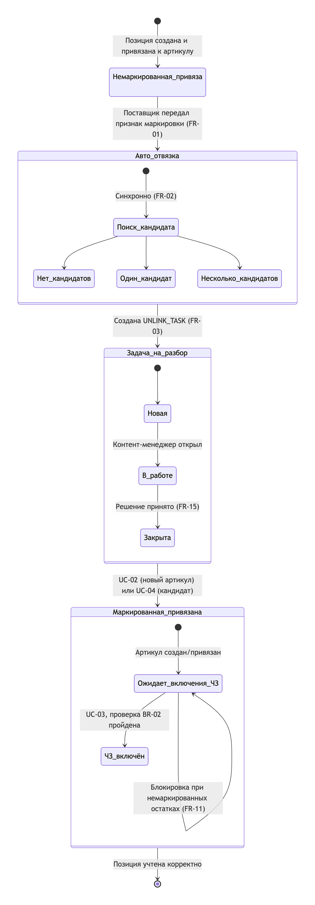

# Подсистема обработки маркированных артикулов в B2B-каталоге

Формализация процесса обнаружения потери привязки позиции поставщика при передаче признака маркировки «Честный ЗНАК» и создания/привязки нового маркированного артикула, с автоматизацией подбора артикула-кандидата.

Версия 1.1

## Содержание

   1. [Общая информация](#1-общая-информация)
      - [Наименование](#наименование)
      - [Цель](#цель)
   2. [Термины](#2-термины)
   3. [Участники процесса](#3-участники-процесса)
   4. [Границы системы](#4-границы-системы)
   5. [AS-IS](#5-as-is)
   6. [TO-BE](#6-to-be)
   7. [Бизнес-правила](#7-бизнес-правила)
   8. [Модель данных](#8-модель-данных)
   9. [Функциональные требования](#9-функциональные-требования)
   10. [Требования к интерфейсу](#10-требования-к-интерфейсу)
   11. [Use cases](#11-use-cases)
      - [UC-00 · Автоматический подбор артикула-кандидата при отвязке](#uc-00--автоматический-подбор-артикула-кандидата-при-отвязке)
      - [UC-01 · Найти отвязанные позиции поставщика](#uc-01--найти-отвязанные-позиции-поставщика)
      - [UC-02 · Создать новый маркированный артикул и привязать позицию](#uc-02--создать-новый-маркированный-артикул-и-привязать-позицию)
      - [UC-03 · Включить признак маркировки](#uc-03--включить-признак-маркировки)
      - [UC-04 · Привязать к уже существующему маркированному артикулу](#uc-04--привязать-к-уже-существующему-маркированному-артикулу)
      - [UC-05 · Разобрать неоднозначный случай (несколько кандидатов)](#uc-05--разобрать-неоднозначный-случай-несколько-кандидатов)
   12. [Обработка исключений](#12-обработка-исключений)
   13. [Нефункциональные требования](#13-нефункциональные-требования)
   14. [Критерии приёмки](#14-критерии-приёмки)

# Создание нового артикула для маркированного товара

## 1 Общая информация

### Наименование

Автоматическое разделение маркированных и немаркированных позиций поставщика, автоматический подбор артикула-кандидата и создание/привязка соответствующего артикула каталога.

### Цель

Необходимо обеспечить раздельный учёт маркированных и немаркированных товаров.

Один внутренний артикул каталога не должен одновременно использоваться для маркированного и немаркированного товара.

Это необходимо для корректной работы склада, приёмки и системы «Честный ЗНАК»: система должна понимать, для какой позиции требуется сканирование КИЗ, а для какой — нет.

**Задачи:**

- Формализовать текущий (ручной) процесс обнаружения отвязки
- Зафиксировать бизнес-правила, нарушение которых создаёт риск смешения режимов учёта
- Описать функциональные требования к рабочему месту «Номенклатура партнеров» в части фильтрации, создания и привязки артикулов
- Автоматизировать поиск артикула-кандидата в момент разрыва связи, устранив ручной периодический поиск отвязанных позиций
- Обеспечить контент-менеджера явным уведомлением/очередью задач по каждому событию отвязки, включая случаи с несколькими кандидатами

## 2 Термины

| **Термин**                         | **Определение**                                                    |
|------------------------------------|---------------------------------------------------------------------|
| **Наш артикул / артикул каталога** | Внутренняя номенклатура компании                                     |
| **Артикул поставщика**             | Номенклатура, которую поставщик передаёт через прайс/API             |
| **Маркированный товар**            | Товар с признаком маркировки «Честный ЗНАК»                          |
| **Немаркированный товар**          | Товар без признака маркировки                                        |
| **Привязка**                       | Связь позиции поставщика с внутренним артикулом                      |
| **Отвязка**                        | Удаление связи позиции поставщика с внутренним артикулом              |
| **КИЗ**                            | Код идентификации маркированного товара                              |
| **Артикул-кандидат**               | Артикул каталога, автоматически предложенный системой как вероятная цель для привязки отвязанной позиции, на основании совпадения полей сравнения |
| **Задача на разбор**               | Запись в очереди контент-менеджера, создаваемая системой по факту авто-отвязки, содержащая позицию поставщика и найденных кандидатов (если есть) |

## 3 Участники процесса

| Роль                        | Зона ответственности                                                                                                                                                  |
|-----------------------------|-----------------------------------------------------------------------------------------------------------------------------------------------------------------------|
| Поставщик (внешняя система) | Передаёт данные о позиции через API; в какой-то момент начинает передавать признак маркировки                                                                         |
| Система B2B                 | Автоматически разрывает связь при получении признака маркировки; синхронно ищет артикул-кандидат; создаёт задачу на разбор; хранит карточки артикулов и позиций поставщиков |
| Контент-менеджер            | Обрабатывает задачи на разбор, принимает решение (новый артикул / привязка к существующему кандидату / другому артикулу), создаёт и заполняет карточку, включает признак маркировки, верифицирует результат |
| Закупки                     | Участвует в разборе спорных случаев совместно с контент-менеджером (BR-07), в частности при нескольких кандидатах или отсутствии очевидного кандидата; решения не принимает единолично, доступа к операциям создания/привязки/включения признака не имеет |
| Склад                       | Использует признак маркировки для определения необходимости работы с КИЗ                                                                                              |

Пользователем процесса непосредственно является **отдел контента**; закупки привлекаются как консультативная сторона по конкретным задачам на разбор.

## 4 Границы системы

**Входит в область:** рабочее место «Справочники → Номенклатура → Номенклатура партнеров», карточка создания артикула, карточка товара (вкладка «Связанные позиции поставщика», признак «Честный ЗНАК»), операции «Добавить» и «Связать», очередь/список задач на разбор отвязанных позиций, логика автоматического подбора артикула-кандидата.

**Не входит в область:** сама интеграция с системой «Честный ЗНАК» и получение КИЗ со стороны склада; логика обмена данными с поставщиком по API (рассматривается как внешний источник событий); модуль ценообразования.

## 5 AS-IS

В каталоге B2B товар может быть маркированным или немаркированным в системе «Честный ЗНАК». Пока у товара нет признака маркировки, к нему может быть привязано несколько поставщиков одновременно.

Когда один из поставщиков начинает передавать признак маркировки по своей позиции, система обязана разорвать связь этой позиции с немаркированным нашим артикулом — маркированное предложение не может числиться на немаркированном товаре. Остальные поставщики на старом артикуле не затрагиваются.

**Проблема:** разрыв связи происходит автоматически и «незаметно», отдельного уведомления или флага «поставщик включил маркировку» в интерфейсе нет. Контент-менеджер должен сам периодически находить такие позиции вручную и определять причину отвязки.

**Риск при ошибке:** если включить маркировку на артикуле, где уже есть немаркированные остатки или другие немаркированные поставщики, два режима учёта смешаются в одном артикуле.

## 6 TO-BE

Устраняем ручной периодический поиск: система сама фиксирует факт и вероятную причину разрыва в момент, когда он происходит, и сразу предлагает контент-менеджеру готовый вариант решения.

**Момент триггера:** поиск артикула-кандидата выполняется системой синхронно, в момент самого разрыва связи (в рамках той же операции, что и авто-отвязка).

**Критерий поиска:** сравнение отвязанной позиции с существующими маркированными артикулами по явно зафиксированным полям — партномер, вендор, категория. Точное совпадение всех трёх полей — «сильный» кандидат; частичное совпадение (например, вендор + категория) — «слабый» кандидат.

**Результат поиска и дальнейший процесс:**

| Результат поиска              | Что делает система                                                                                     | Что делает контент-менеджер                                          |
|--------------------------------|----------------------------------------------------------------------------------------------------------|-------------------------------------------------------------------------|
| Кандидатов не найдено           | Создаёт задачу на разбор без кандидата, помечает «требуется новый артикул» (по умолчанию)                | Создаёт новый артикул (UC-02) либо вручную находит существующий (UC-04) |
| Найден ровно один сильный кандидат | Создаёт задачу на разбор с предложенным кандидатом                                                    | Подтверждает привязку к кандидату (UC-04) либо отклоняет и решает иначе |
| Найдено несколько кандидатов (сильных и/или слабых) | Создаёт задачу на разбор со списком кандидатов, автовыбор не выполняется (BR-07)         | Разбирает вручную, при необходимости — совместно с закупками (UC-05)    |

Задачи на разбор попадают в единую очередь/список, доступный контент-менеджеру из рабочего места «Номенклатура партнеров»; ручной периодический поиск отвязанных позиций (UC-01) становится не основным, а дополнительным способом попасть к той же позиции (например, если задача была отклонена или требует повторного рассмотрения).

**Метрика успеха:** сокращение времени от отвязки до создания/привязки корректного артикула; снижение числа позиций, «зависающих» без обработки; доля задач на разбор, закрытых без обращения к ручному поиску (UC-01).

## 7 Бизнес-правила

| №   | Правило                                                                                                                     | Тип         |
|-----|-------------------------------------------------------------------------------------------------------------------------------|-------------|
| 1   | Маркированную позицию поставщика нельзя привязывать обратно к артикулу без признака маркировки                               | ограничение |
| 2   | Признак маркировки нельзя включать на артикуле, где уже есть немаркированные остатки или другие немаркированные поставщики   | ограничение |
| 3   | Новый артикул не создаётся «про запас» — только после факта отвязки или явного понимания, что позиция новая и маркированная   | процедурное |
| 4   | Связывание позиции с артикулом — только один к одному за одну операцию                                                        | ограничение |
| 5   | Перед связыванием с существующим артикулом на нём уже должен быть включён признак маркировки                                  | ограничение |
| 6   | «Честный ЗНАК» ≠ «Марк. спецпредложения» ≠ «Прослеживаемый товар» (ГТД/РНПТ) — разные контуры учёта, хранятся как отдельные независимые признаки товара | определение |
| 7   | Спорные случаи (в т. ч. несколько кандидатов) решаются совместно контентом и закупками, а не восстановлением старой привязки и не автоматическим выбором | процедурное |
| 8   | Поиск артикула-кандидата выполняется системой автоматически при каждой авто-отвязке; результат поиска (включая «кандидатов не найдено») фиксируется в задаче на разбор | процедурное |

## 8 Модель данных

**Ключевые сущности:**

- **ARTICLE** (артикул каталога) — внутренняя карточка товара; поля включают признак `is_marked` («Честный ЗНАК»), а также независимые от него признаки `is_special_offer_marked` («Марк. спецпредложения») и `is_traceable` («Прослеживаемый товар», ГТД/РНПТ) — см. BR-06.
- **SUPPLIER_POSITION** (позиция поставщика) — карточка предложения поставщика; поле `article_id_fk` — внешний ключ на ARTICLE (может быть `null`); поле `is_marked_by_supplier` — признак, переданный поставщиком по API.
- **UNLINK_TASK** (задача на разбор) — создаётся системой при каждой авто-отвязке; хранит ссылку на SUPPLIER_POSITION, список найденных ARTICLE-кандидатов (может быть пустым), статус («новая» / «в работе» / «закрыта»), результат разбора и исполнителя.

**Ключевое событие:** `SUPPLIER_POSITION.article_id_fk` становится `null` без ручного действия пользователя — это событие «авто-отвязка по маркировке». В той же транзакции система выполняет поиск кандидатов среди ARTICLE с `is_marked = true` по полям партномер/вендор/категория и создаёт запись UNLINK_TASK с результатом поиска.

## 9 Функциональные требования

| ID     | Требование                                                                                                                                          | Приоритет |
|--------|--------------------------------------------------------------------------------------------------------------------------------------------------------|-----------|
| FR-01  | Система должна автоматически разрывать связь позиции поставщика с артикулом при получении от него признака маркировки                                   | Высокий   |
| FR-02  | В момент авто-отвязки система должна синхронно выполнять поиск артикулов-кандидатов по партномеру, вендору и категории                                  | Высокий   |
| FR-03  | По результату поиска система должна создавать задачу на разбор с указанием позиции поставщика и найденных кандидатов (или отметкой «кандидатов не найдено») | Высокий   |
| FR-04  | Система должна предоставлять контент-менеджеру список/очередь задач на разбор с фильтрацией по статусу и поставщику                                     | Высокий   |
| FR-05  | При наличии нескольких кандидатов система не должна выполнять автоматический выбор — решение фиксируется только вручную (BR-07)                          | Высокий   |
| FR-06  | Интерфейс «Номенклатура партнеров» должен позволять фильтровать позиции по поставщику, по признаку привязки, по наличию и участию в ценообразовании      | Высокий   |
| FR-07  | Фильтр «Показать все» должен снимать базовые ограничения («Только в наличии», «Участвует в ценообразовании»)                                             | Высокий   |
| FR-08  | При выборе непривязанной позиции форма создания должна предзаполняться наименованием и партномером поставщика с возможностью редактирования               | Высокий   |
| FR-09  | Действие «Добавить» должно одновременно создавать артикул и привязывать к нему выбранную позицию                                                        | Высокий   |
| FR-10  | Включение признака маркировки должно быть отдельным явным действием на карточке товара, а не частью создания артикула                                    | Высокий   |
| FR-11  | Система должна блокировать сохранение признака маркировки при наличии немаркированных остатков/поставщиков на артикуле                                   | Высокий   |
| FR-12  | Действие «Связать» должно быть доступно только при выделении ровно одного артикула и одной позиции поставщика (BR-04)                                    | Высокий   |
| FR-13  | Действие «Связать» должно проверять, что на выбранном артикуле уже включён признак маркировки (BR-05)                                                    | Высокий   |
| FR-14  | На вкладке «Связанные позиции поставщика» карточки товара должны отображаться только актуально привязанные позиции                                       | Высокий   |
| FR-15  | При закрытии задачи на разбор (привязкой или созданием артикула) статус задачи должен автоматически меняться на «закрыта»                                | Средний   |

## 10 Требования к интерфейсу

На основе экранов исходного руководства пользователя и предложенной автоматизации выделены следующие экранные формы:

- **Очередь задач на разбор** (новый экран) — список задач с колонками: позиция поставщика, поставщик, статус, число найденных кандидатов; фильтры по статусу и поставщику; открытие задачи ведёт в панель связывания/создания с уже подставленным кандидатом (если он один)
- **Список «Номенклатура партнеров»** — верхняя панель: наши товары; нижняя панель: позиции поставщиков с фильтрами «Поставщик», «Привязанные», «Только в наличии», «Участвует в ценообразовании», кнопка «Показать все»; колонка «ЧЗ» отмечает маркированные позиции
- **Форма создания артикула** (левая панель) — поля: категория, вендор, тип товара, единица измерения, НДС, кратность, конверт; кнопка «Добавить»
- **Карточка товара** — переключатель признака «Честный ЗНАК»; вкладка «Связанные позиции поставщика»
- **Панель связывания** — выбор одного артикула сверху (предзаполняется кандидатом из задачи, если он единственный) и одной позиции снизу, кнопка «Связать»

## 11 Use cases

### UC-00 · Автоматический подбор артикула-кандидата при отвязке

**User story:** Как контент-менеджер, я хочу, чтобы при авто-отвязке система сама подбирала артикул-кандидата и заводила задачу, чтобы не искать отвязанные позиции вручную.

- **Actor:** Система B2B (пользователь не участвует)
- **Trigger:** Поставщик передаёт признак маркировки по позиции
- **Precondition:** Позиция привязана к немаркированному артикулу

**Basic flow**
1. Система получает признак маркировки от поставщика
2. Разрывает связь позиции с текущим артикулом (`article_id_fk = null`)
3. Ищет среди маркированных артикулов совпадения по партномеру/вендору/категории
4. Классифицирует совпадения: «сильное» (все 3 поля) / «слабое» (частичное)
5. Создаёт задачу на разбор со статусом «новая»

**Alternative flow**
- 3a. Кандидатов нет → задача с пометкой «требуется новый артикул»
- 3b. Один сильный кандидат → задача с предзаполненным кандидатом
- 3c. Несколько кандидатов → задача со списком, без автовыбора

**Exception flow**
- Поиск завершился ошибкой/таймаутом → ошибка логируется, задача создаётся с пометкой «ошибка поиска», позиция остаётся доступной через UC-01

**Postcondition:** позиция отвязана; создана задача с одним из результатов поиска

**Acceptance criteria**
1. Given маркированная позиция была привязана, When поставщик передаёт признак маркировки, Then система в той же транзакции устанавливает `article_id_fk = null`.
2. Given произошла авто-отвязка, When система обрабатывает событие, Then выполняется поиск среди `ARTICLE` с `is_marked = true` по партномеру, вендору, категории.
3. Given кандидатов не найдено, Then создаётся `UNLINK_TASK` со статусом «новая», пустым списком кандидатов и пометкой «требуется новый артикул».
4. Given найден ровно один кандидат с совпадением по всем трём полям, Then задача создаётся с этим кандидатом, помеченным «сильный».
5. Given найдено несколько кандидатов (любая комбинация сильных/слабых), Then все они попадают в задачу без предвыбора — автопривязка не выполняется.
6. Given любой из исходов, Then система сама не выполняет привязку ни в одном случае.
7. Given поиск кандидата завершился ошибкой/таймаутом, Then ошибка логируется, а позиция остаётся доступной через ручной поиск (UC-01).

---

### UC-01 · Найти отвязанные позиции поставщика

**User story:** Как контент-менеджер, я хочу отфильтровать позиции поставщика по непривязанности, чтобы найти те, что требуют разбора вручную, даже если по ним не создана задача.

- **Actor:** Контент-менеджер
- **Trigger:** Нужно найти позицию вне очереди задач (повторный разбор отклонённой задачи, точечная проверка)
- **Precondition:** Пользователь на экране «Номенклатура партнеров»

**Basic flow**
1. Открывает список позиций поставщиков
2. Задаёт фильтр «Поставщик»
3. Просматривает список (по умолчанию: «в наличии» + «участвует в ценообразовании», «привязанные» выкл)
4. При необходимости — «Показать все»

**Postcondition:** список отвязанных позиций выбранного поставщика отображён

**Acceptance criteria**
1. Given выбран фильтр «Поставщик», When список загружается, Then показаны только позиции этого поставщика.
2. Given фильтры по умолчанию, Then видны только позиции «в наличии» и «участвует в ценообразовании»; переключатель «Привязанные» выключен.
3. Given нажато «Показать все», Then оба базовых фильтра снимаются.
4. Given позиция без `article_id_fk`, Then она визуально отличима в списке.

---

### UC-02 · Создать новый маркированный артикул и привязать позицию

**User story:** Как контент-менеджер, я хочу создать артикул на основе данных позиции поставщика и сразу привязать её, чтобы не заполнять карточку с нуля.

- **Actor:** Контент-менеджер
- **Trigger:** Задача без кандидатов / кандидаты отклонены / позиция найдена через UC-01
- **Precondition:** Позиция отвязана

**Basic flow**
1. Открывает задачу (или позицию из UC-01)
2. Инициирует создание артикула
3. Система предзаполняет наименование и партномер
4. Пользователь заполняет остальные поля (категория, вендор, ед.изм., НДС)
5. Нажимает «Добавить»
6. Система создаёт артикул и одной операцией привязывает позицию
7. Если из задачи — задача закрывается с результатом «создан новый артикул»

**Alternative flow**
- Пользователь отменяет создание → задача остаётся открытой

**Postcondition:** артикул создан и привязан; признак маркировки ещё выключен

**Acceptance criteria**
1. Given задача без кандидатов (или кандидаты отклонены), When открыта форма создания, Then поля «Наименование» и «Партномер» предзаполнены данными поставщика и редактируемы.
2. When нажато «Добавить» с заполненными обязательными полями, Then артикул создаётся и сразу привязывается одной атомарной операцией.
3. Given операция прошла успешно, Then позиция исчезает из списка непривязанных.
4. Given действие выполнено из задачи на разбор, Then статус задачи меняется на «закрыта» с результатом «создан новый артикул» (FR-15).
5. Given артикул создан, Then признак маркировки остаётся выключенным до отдельного действия (UC-03).

---

### UC-03 · Включить признак маркировки

**User story:** Как контент-менеджер, я хочу включить признак «Честный ЗНАК», чтобы склад корректно требовал КИЗ, и быть уверенным, что система не даст создать конфликт режимов учёта.

- **Actor:** Контент-менеджер
- **Trigger:** Артикул создан/выбран, признак ещё не включён
- **Precondition:** Артикул существует, позиция привязана

**Basic flow**
1. Открывает карточку товара
2. Включает переключатель «Честный ЗНАК»
3. Сохраняет
4. Система проверяет отсутствие немаркированных остатков/поставщиков
5. Признак сохраняется

**Alternative flow**
- 4a. Найдены немаркированные остатки/поставщики → сохранение блокируется с объяснением, признак не сохраняется

**Postcondition:** признак включён и сохранён (либо блокирован)

**Acceptance criteria**
1. Given на артикуле есть немаркированные остатки/поставщики, When включается признак, Then сохранение блокируется с объяснением причины (BR-02).
2. Given конфликтов нет, When признак включён и сохранён, Then значение сохраняется как `true`.
3. Given сохранение прошло успешно, Then позиция видна на новом артикуле и отсутствует на старом.

---

### UC-04 · Привязать к уже существующему маркированному артикулу

**User story:** Как контент-менеджер, я хочу подтвердить предложенного системой кандидата одним действием, чтобы не плодить дубль, если модель уже заведена.

- **Actor:** Контент-менеджер
- **Trigger:** Задача с единственным кандидатом / ручной подбор через UC-01
- **Precondition:** Кандидат — маркированный артикул с уже включённым признаком

**Basic flow**
1. Открывает задачу (кандидат предзаполнен) либо выбирает вручную
2. Проверяет выделение: ровно один артикул + одна позиция
3. Нажимает «Связать»
4. Система проверяет, что признак маркировки на артикуле включён
5. `article_id_fk` позиции обновляется
6. Если из задачи — закрывается с результатом «привязано к кандидату»

**Alternative flow**
- 2a. Выделение некорректно → кнопка неактивна
- 4a. Признак выключен → действие блокируется с объяснением

**Postcondition:** позиция привязана к существующему артикулу

**Acceptance criteria**
1. Given выделены ровно один артикул и одна позиция, Then кнопка «Связать» активна; в противном случае — неактивна (BR-04).
2. Given на выбранном артикуле признак маркировки выключен, When нажато «Связать», Then действие блокируется с объяснением (BR-05).
3. Given выбор корректен и признак включён, When нажато «Связать», Then `article_id_fk` позиции обновляется на id выбранного артикула.
4. Given действие выполнено из задачи с единственным кандидатом, Then кандидат предзаполнен, а после привязки задача закрывается с результатом «привязано к кандидату» (FR-15).

---

### UC-05 · Разобрать неоднозначный случай (несколько кандидатов)

**User story:** Как контент-менеджер, я хочу видеть всех кандидатов и при необходимости привлечь закупки, чтобы не полагаться на автовыбор в спорных случаях.

- **Actor:** Контент-менеджер, при участии закупок
- **Trigger:** Задача с 2+ кандидатами
- **Precondition:** Задача создана системой (UC-00) с несколькими кандидатами

**Basic flow**
1. Открывает задачу, видит кандидатов с типом совпадения
2. При необходимости привлекает закупки
3. Принимает решение: привязка к кандидату или новый артикул
4. Выполняет UC-04 или UC-02
5. Задача закрывается с указанием решения

**Alternative flow**
- 2a. Закупки предлагают решение → фиксируется комментарием; закрыть задачу может только контент-менеджер

**Postcondition:** спорный случай разрешён и зафиксирован

**Acceptance criteria**
1. Given задача с 2+ кандидатами, When открыта контент-менеджером, Then все кандидаты показаны с типом совпадения (сильный/слабый), без предвыбора.
2. Then система не предлагает массовое подтверждение или автовыбор для такой задачи (BR-07, FR-05).
3. Given выбрана привязка, Then применяется поток UC-04, задача закрывается с указанием выбранного кандидата.
4. Given выбрано создание нового артикула, Then применяется поток UC-02, задача закрывается с результатом «создан новый артикул».
5. Given привлечены закупки, Then их решение можно зафиксировать (например, комментарием), но закрыть задачу может только контент-менеджер (ограничение роли из раздела 13).

### Sequence Diagram

### Диаграмма состояний 

## 12 Обработка исключений

| Ситуация | Ожидаемое поведение системы |
| --- | --- |
| Попытка привязать маркированную позицию к немаркированному артикулу | Действие «Связать» недоступно / блокируется валидацией |
| Попытка включить маркировку при наличии немаркированных остатков | Сохранение карточки блокируется с объяснением причины |
| Попытка создать артикул для позиции, которая ещё привязана к старому товару | Позиция не отображается в списке «непривязанных» — создание невозможно по данным |
| Найдено несколько кандидатов на «тот же» маркированный артикул | Решение передаётся на ручной разбор контент-менеджером и закупками (BR-07, UC-05), автовыбор не допускается |
| Задача на разбор не обработана длительное время | Задача остаётся в очереди со статусом «новая» / «в работе»; фиксируется в метриках (см. раздел 6), автоматическое закрытие не выполняется |

## 13 Нефункциональные требования

- **Целостность данных:** не допускается состояние, при котором на одном артикуле одновременно числятся маркированные и немаркированные позиции/остатки
- **Аудит:** изменение признака маркировки, операции создания/связывания, а также создание и закрытие задач на разбор должны логироваться с указанием пользователя (или системы — для UC-00) и времени
- **Доступ:** операции создания артикула, включения признака маркировки и связывания доступны только роли «контент-менеджер»; роль «закупки» имеет доступ на просмотр и комментирование задач на разбор, без права выполнять сами операции
- **Производительность:** фильтрация списка позиций по поставщику, а также синхронный поиск кандидата в момент авто-отвязки должны отрабатывать без заметной задержки при типовом объёме каталога
- **Наблюдаемость:** система должна предоставлять метрики по разделу 6 (среднее время от отвязки до закрытия задачи, число открытых задач без обработки, доля задач с автоматически найденным единственным кандидатом)

## 14 Критерии приёмки

- Все требования раздела 9 (FR-01…FR-15) реализованы и проверены на тестовых позициях минимум двух поставщиков
- Ни одно из бизнес-правил раздела 7 (1-8) не может быть нарушено через интерфейс — проверяется через тест-кейсы на каждое правило
- Для каждого сценария из раздела 6 (нет кандидата / один кандидат / несколько кандидатов) воспроизведён сквозной путь от авто-отвязки до закрытия задачи на разбор
- Исключения раздела 12 воспроизводимы и обрабатываются согласно описанному поведению
- Метрики раздела 13 доступны для просмотра ответственным лицом и отражают реальные тестовые сценарии
