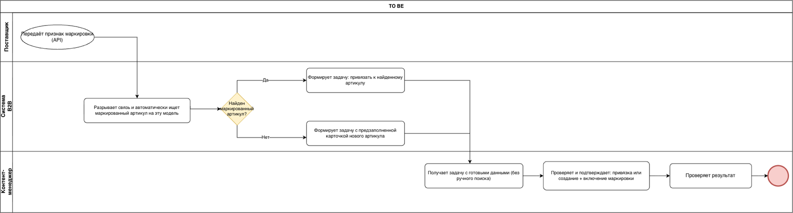
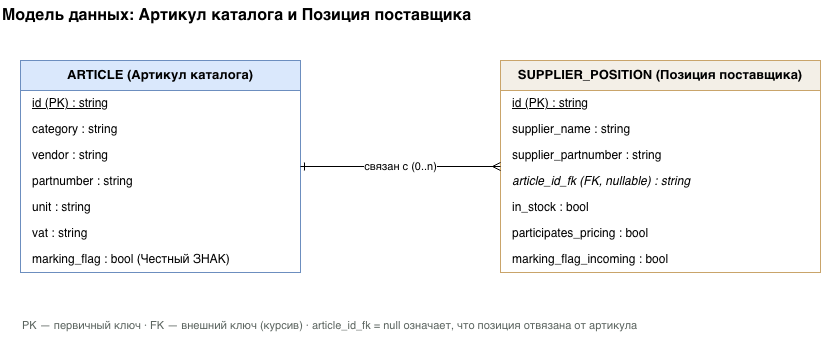

# Cоздание нового артикула для маркированного товара

## Общая информация

### Наименование

Автоматическое разделение маркированных и немаркированных позиций
поставщика и создание/привязка соответствующего артикула каталога.

### Цель

Необходимо обеспечить раздельный учёт маркированных и немаркированных
товаров.

Один внутренний артикул каталога не должен одновременно использоваться
для маркированного товара и немаркированного товара.

В исходном процессе это необходимо для корректной работы склада, приёмки
и «Честного ЗНАКа»: система должна понимать, для какой позиции требуется
сканирование КИ

**Задачи:**

-   Формализовать текущий (ручной) процесс обнаружения отвязки

-   Зафиксировать бизнес-правила, нарушение которых создаёт риск
    смешения режимов учёта

-   Описать функциональные требования к рабочему месту «Номенклатура
    партнеров» в части фильтрации, создания и привязки артикулов

-   Предложить улучшение процесса, устраняющее ручной периодический
    поискЗ, а для какой --- нет.

## Термины

  -----------------------------------------------------------------------
  **Термин**                  **Определение**
  --------------------------- -------------------------------------------
  **Наш артикул / артикул     Внутренняя номенклатура компании
  каталога**                  

  **Артикул поставщика**      Номенклатура, которую поставщик передаёт
                              через прайс/API

  **Маркированный товар**     Товар с признаком маркировки «Честный ЗНАК»

  **Немаркированный товар**   Товар без признака маркировки

  **Привязка**                Связь позиции поставщика с внутренним
                              артикулом

  **Отвязка**                 Удаление связи позиции поставщика с
                              внутренним артикулом

  **КИЗ**                     Код идентификации маркированного товара
  -----------------------------------------------------------------------

## 

## Участники процесса

  -------------------------------------------------------------------------
  Роль               Зона ответственности
  ------------------ ------------------------------------------------------
  Поставщик (внешняя Передаёт данные о позиции через API; в какой-то момент
  система)           начинает передавать признак маркировки

  Система B2B        Автоматически разрывает связь при получении признака
                     маркировки; хранит карточки артикулов и позиций
                     поставщиков

  Контент-менеджер   Обнаруживает отвязку, принимает решение (новый артикул
                     / привязка к существующему), создаёт и заполняет
                     карточку, включает признак маркировки, верифицирует
                     результат

  Склад              Использует признак маркировки для определения
                     необходимости работы с КИЗ.
  -------------------------------------------------------------------------

Пользователем процесса непосредственно является **отдел контента**.

##  Границы системы

**Входит в область:** рабочее место «Справочники → Номенклатура →
Номенклатура партнеров», карточка создания артикула, карточка товара
(вкладка «Связанные позиции поставщика», признак «Честный ЗНАК»),
операции «Добавить» и «Связать».

**Не входит в область:** сама интеграция с системой «Честный ЗНАК» и
получение КИЗ со стороны склада; логика обмена данными с поставщиком по
API (рассматривается как внешний источник событий); модуль
ценообразования.

## AS-IS

В каталоге B2B товар может быть маркированным или немаркированным в
системе «Честный ЗНАК». Пока у товара нет признака маркировки, к нему
может быть привязано несколько поставщиков одновременно.

Когда один из поставщиков начинает передавать признак маркировки по
своей позиции, система обязана разорвать связь этой позиции с
немаркированным нашим артикулом --- маркированное предложение не может
числиться на немаркированном товаре. Остальные поставщики на старом
артикуле не затрагиваются.

**Проблема:** разрыв связи происходит автоматически и «незаметно»,
отдельного уведомления или флага «поставщик включил маркировку» в
интерфейсе нет. Контент-менеджер должен сам периодически находить такие
позиции вручную, определять причину.

**Риск при ошибке:** если маркировку включить на артикуле, где уже есть
немаркированные остатки или другие немаркированные поставщики в одном
артикуле смешаются два режима учёта.

## TO-BE

Устраняем ручной периодический поиск: система сама знает причину разрыва
в момент, когда он происходит

**Момент триггера:** поиск маркированного артикула-кандидата выполняется
системой синхронно, в момент самого разрыва связи

**Критерий поиска:** явно зафиксированные поля сравнения --- партномер,
вендор, категория

**Неоднозначность:** при нескольких кандидатах --- задача требует
ручного выбора

**Метрика успеха:** сокращение времени от отвязки до создания
корректного артикула; снижение числа позиций, «зависающих» без обработки

{width="7.618627515310586in"
height="2.0481933508311463in"}

## Бизнес-правила

  --------------------------------------------------------------------------
  №   Правило                                                  Тип
  --- -------------------------------------------------------- -------------
  1   Маркированную позицию поставщика нельзя привязывать      ограничение
      обратно к артикулу без признака маркировки               

  2   Признак маркировки нельзя включать на артикуле, где уже  ограничение
      есть немаркированные остатки или другие немаркированные  
      поставщики                                               

  3   Новый артикул не создаётся «про запас» --- только после  процедурное
      факта отвязки или явного понимания, что позиция новая и  
      маркированная                                            

  4   Связывание позиции с артикулом --- только один к одному  ограничение
      за одну операцию                                         

  5   Перед связыванием с существующим артикулом на нём уже    ограничение
      должен быть включён признак маркировки                   

  6   «Честный ЗНАК» ≠ «Марк. спецпредложения» ≠               определение
      «Прослеживаемый товар» (ГТД/РНПТ) --- разные контуры     
      учёта                                                    

  7   Спорные случаи решаются совместно контентом и закупками, процедурное
      а не восстановлением старой привязки                     
  --------------------------------------------------------------------------

## Модель данных

SUPPLIER_POSITION.article_id_fk становится null без ручного действия
пользователя --- это событие «авто-отвязка по маркировке».

{width="7.402061461067366in"
height="3.0691469816272967in"}

## Функциональные требования

  --------------------------------------------------------------------------
  ID   Требование                                                Приоритет
  ---- --------------------------------------------------------- -----------
  1    Система должна автоматически разрывать связь позиции      Высокий
       поставщика с артикулом при получении от него признака     
       маркировки                                                

  2    Интерфейс «Номенклатура партнеров» должен позволять       Высокий
       фильтровать позиции по поставщику, по признаку привязки,  
       по наличию и участию в ценообразовании                    

  3    Фильтр «Показать все» должен снимать базовые ограничения  Высокий
       («Только в наличии», «Участвует в ценообразовании»)       

  4    При выборе непривязанной позиции форма создания должна    Высокий
       предзаполняться наименованием и партномером поставщика с  
       возможностью редактирования                               

  5    Действие «Добавить» должно одновременно создавать артикул Высокий
       и привязывать к нему выбранную позицию                    

  6    Включение признака маркировки должно быть отдельным явным Высокий
       действием на карточке товара, а не частью создания        
       артикула                                                  

  7    Система должна блокировать сохранение признака маркировки Высокий
       при наличии немаркированных остатков/поставщиков на       
       артикуле                                                  

  8    Действие «Связать» должно быть доступно только при        Высокий
       выделении ровно одного артикула и одной позиции           
       поставщика (BR-04)                                        

  9    Действие «Связать» должно проверять, что на выбранном     Высокий
       артикуле уже включён признак маркировки (BR-05)           

  10   На вкладке «Связанные позиции поставщика» карточки товара Высокий
       должны отображаться только актуально привязанные позиции  
  --------------------------------------------------------------------------

## Требования к интерфейсу

На основе экранов исходного руководства пользователя выделены следующие
экранные формы:

-   **Список «Номенклатура партнеров»** --- верхняя панель: наши товары;
    нижняя панель: позиции поставщиков с фильтрами «Поставщик»,
    «Привязанные», «Только в наличии», «Участвует в ценообразовании»,
    кнопка «Показать все»; колонка «ЧЗ» отмечает маркированные позиции

-   **Форма создания артикула** (левая панель) --- поля: категория,
    вендор, тип товара, единица измерения, НДС, кратность, конверт;
    кнопка «Добавить»

-   **Карточка товара** --- переключатель признака «Честный ЗНАК»;
    вкладка «Связанные позиции поставщика»

-   **Панель связывания** --- выбор одного артикула сверху и одной
    позиции снизу, кнопка «Связать»
