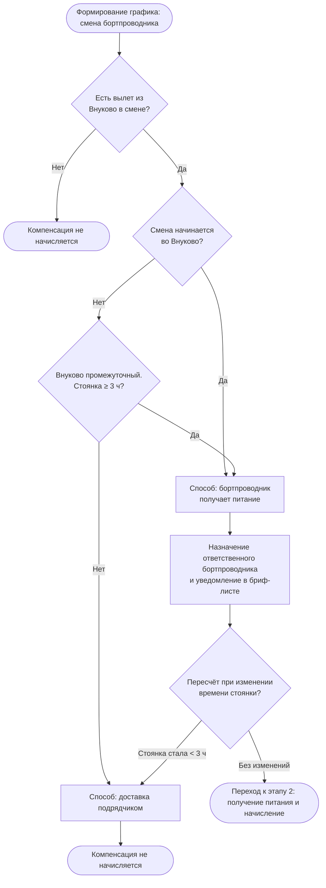

# Задача 1. «Заказ еды на борт»

В авиакомпании планируется ввести услугу «Заказ еды на борт».

Клиент компании через официальный сайт сможет приобрести еду и напитки, которые ему предоставит бортпроводник в процессе выполнения рейса.

Услугу можно будет приобрести не позднее чем за 24 часа до вылета.

Поставщиком еды будет сторонняя компания.

Поставщик получит заказ клиента и доставит его в аэропорт к установленному времени. Наземная служба обеспечит приём и передачу питания на борт.

Опишите предполагаемую схему взаимодействий участников данного бизнес-процесса после ввода услуги в эксплуатацию.

Какими данными должны обмениваться участники процесса и в какой момент времени?

## 1.1. Участники

| Участник | Роль |
|---|---|
| Клиент (пассажир) | Выбирает, оформляет и оплачивает заказ |
| Сайт авиакомпании | Интерфейс: проверка бронирования, меню, оформление, статус заказа. Бизнес-логики заказа не содержит |
| Система бронирования | Источник данных о бронировании, пассажире, рейсе. Сообщает об изменениях рейса |
| Система управления заказами питания | Создаёт и хранит заказы, меню и остатки, контролирует сроки и статусы, взаимодействует с платёжной системой и поставщиком |
| Платёжная система | Проведение платежей и возвратов |
| Поставщик питания (сторонняя компания) | Принимает заказ, подтверждает исполнимость, комплектует, доставляет в аэропорт |
| Наземная служба | Принимает питание в аэропорту, проверяет количество, передаёт на борт |
| Бортпроводник | Получает список заказов, выдаёт питание, фиксирует результат |
| Бухгалтерия | Получает реестр выполненных заказов для расчётов с поставщиком |


## 1.2. Основной сценарий

1. Клиент вводит на сайте номер бронирования и фамилию.
2. Сайт запрашивает данные бронирования в Системе бронирования и получает рейс, пассажира, место, статус.
3. Сайт проверяет, что бронирование активно и до вылета осталось не менее 24 часов. Иначе услуга недоступна.
4. Сайт запрашивает в Системе заказов меню для рейса и показывает его клиенту (цены, состав, аллергены, остатки).
5. Клиент выбирает позиции. Сайт передаёт их в Систему заказов.
6. Система заказов проверяет остатки и резервирует позиции, создаёт заказ (`CREATED`), считает сумму, возвращает `order_id` и срок действия неоплаченного заказа.
7. Клиент нажимает «Оплатить». Сайт запрашивает оплату у Системы заказов. Система заказов переводит заказ в `PAYMENT_PENDING`, создаёт платёж в Платёжной системе и возвращает сайту ссылку на оплату. Сайт перенаправляет клиента.
8. Платёжная система передаёт результат в Систему заказов (callback). Повторный callback игнорируется (идемпотентность по ID платежа).
   - Успех: `PAID`, сайт показывает подтверждение, клиент получает чек.
   - Ошибка: `PAYMENT_FAILED`, клиент может повторить оплату, если заказ ещё не истёк и до вылета осталось не менее 24 часов.
9. Если callback не пришёл в установленное время, Система заказов сама запрашивает статус платежа в Платёжной системе.

### 1.2.2 Изменение и отмена, если до времени вылета осталось не менее 24 часов

10. Клиент может отменить оплаченный заказ. Система заказов переводит его в `CANCELLED`, инициирует возврат по правилам, после чего заказ получает статус `REFUND_PENDING`, а после подтверждения возврата — `REFUNDED`.
11. Изменение состава заказа выполняется как отмена с возвратом и создание нового заказа.

### 1.2.3. Cut-off и передача поставщику

12. За 24 часа до вылета Система заказов закрывает приём заказов, оплаты и изменений. Неоплаченные заказы (`CREATED`, `PAYMENT_PENDING`, `PAYMENT_FAILED`) переводятся в `EXPIRED`, резервы снимаются.
13. Оплаченные заказы по рейсу передаются поставщику одной заявкой (статус `SENT_TO_SUPPLIER`).
14. Поставщик подтверждает заказ (`SUPPLIER_CONFIRMED`) или отклоняет его (`SUPPLIER_REJECTED`) полностью или по отдельным позициям. Если поставщик не ответил в установленный срок, Система заказов отправляет ему напоминание и уведомляет ответственного сотрудника авиакомпании.
15. При отказе клиенту сообщают о невозможности исполнения заказа и предлагают замену позиции. Если клиент согласен, заказ обновляется и снова уходит поставщику (`SUPPLIER_CONFIRMED` после подтверждения). Если нет, заказ получает статус `REFUND_PENDING`, выполняется возврат и заказ переходит в `REFUNDED`.

### 1.2.4. Изменение рейса

16. Система бронирования сообщает Системе заказов об изменении рейса (время, дата, самолёт, отмена рейса) или бронирования (отмена билета).
17. Система заказов оценивает возможность исполнения:
    - можно исполнить (например, небольшой сдвиг времени): обновляет данные для поставщика и наземной службы, уведомляет клиента;
    - нельзя исполнить (отмена рейса или билета, перенос на другую дату): заказ переводится в `CANCELLED` с причиной «по инициативе авиакомпании», поставщику и наземной службе уходит отмена, клиенту — уведомление и полный возврат.

### 1.2.5. Доставка и загрузка на борт

18. Поставщик комплектует заказ и доставляет питание в аэропорт к установленному сроку.
19. Наземная служба принимает питание, сверяет количество с заявкой и фиксирует факт: время и фактическое количество. Заказы получают статус `DELIVERED`. Заказы, по которым есть недопоставка, получают статус `DELIVERY_FAILED`, клиенту оформляется возврат.
20. Наземная служба передаёт питание экипажу, загружает его на борт и подтверждает загрузку в Системе заказов. Заказы получают статус `ON_BOARD`.


### 1.2.6. Выдача в полёте

21. Система заказов передаёт бортпроводнику список заказов рейса: `order_id`, пассажир, место, состав, особые требования. Список загружается на электронное устройство бортпроводника до вылета. В полёте связи с Системой заказов может не быть.
22. Бортпроводник выдаёт питание и отмечает на устройстве по каждому заказу «выдан» или «не выдан» с причиной.
23. После посадки устройство синхронизируется с Системой заказов, результаты передаются пакетом. Выданные заказы получают `ISSUED`, затем `COMPLETED`. Невыданные получают `NOT_ISSUED`, затем `REFUND_PENDING` и `REFUNDED` (по правилам компенсации).

### 1.2.7. Взаиморасчёты

24. После синхронизации результатов рейса Система заказов формирует реестр выполненных и невыполненных заказов: суммы, статусы, возвраты.
25. Реестр передаётся в Бухгалтерию, которая проводит расчёты с поставщиком только по фактически выполненным заказам.


## 1.3. Диаграмма последовательности

```
@startuml
autonumber

actor "Клиент" as C
participant "Сайт компании" as W
participant "Система бронирования" as P
participant "Система управления\nзаказами питания" as OMS
participant "Платёжная система" as PG
participant "Поставщик питания" as S
participant "Наземная служба" as G
actor "Бортпроводник" as F
participant "Бухгалтерия" as A

== Оформление заказа ==

C -> W: Номер бронирования, фамилия
W -> P: Запрос данных бронирования
P --> W: Данные бронирования,\nрейс, пассажир, место, статус

W -> W: Проверка возможности заказа\nT - время вылета >= 24 ч

W -> OMS: Запрос меню по рейсу
OMS --> W: Доступные позиции,\nцены, состав, аллергены, остатки

W --> C: Отображение меню

C -> W: Выбор позиций
W -> OMS: Создание заказа
OMS --> W: ID заказа, сумма,\nстатус CREATED

W -> PG: Инициация оплаты\nID заказа, сумма, валюта
PG --> W: URL/идентификатор оплаты

W --> C: Переход к оплате

PG -> OMS: Callback результата оплаты\nID заказа, ID платежа, статус

alt Оплата успешна
    OMS -> OMS: CREATED/PAYMENT_PENDING -> PAID
    OMS --> W: Статус PAID
    W --> C: Подтверждение заказа + чек
else Ошибка оплаты
    OMS -> OMS: PAYMENT_PENDING -> PAYMENT_FAILED
    OMS --> W: Статус PAYMENT_FAILED
    W --> C: Ошибка оплаты,\nвозможность повторить
end

== До T-24 ==

opt Отмена до cut-off
    C -> W: Отмена заказа
    W -> OMS: Запрос отмены
    OMS -> PG: Запрос возврата
    PG --> OMS: Результат возврата
    OMS -> OMS: PAID -> CANCELLED/REFUNDED
    OMS --> W: Статус заказа
    W --> C: Подтверждение отмены и возврата
end

== T-24 ==

OMS -> OMS: Наступление cut-off T-24
OMS -> OMS: Закрытие приёма новых заказов\nи изменений

OMS -> S: Передача оплаченного заказа\nID заказа, рейс, пассажир,\nместо, состав, количество,\nвремя и место доставки

S --> OMS: Подтверждение получения\nи возможности исполнения

alt Поставщик подтвердил
    OMS -> OMS: PAID -> SENT_TO_SUPPLIER
else Поставщик отказал
    OMS -> OMS: PAID -> SUPPLIER_REJECTED
    OMS -> PG: Возврат средств
    OMS --> W: Уведомление о невозможности\nисполнения заказа
    W --> C: Уведомление + возврат
end

== Изменение рейса ==

opt Изменение рейса до исполнения заказа
    P -> OMS: Изменение рейса\nвремя / дата / статус / самолёт

    alt Заказ ещё может быть исполнен
        OMS -> S: Обновление данных заказа
        S --> OMS: Подтверждение изменений
        OMS --> W: Обновлённые данные заказа
        W --> C: Уведомление об изменении
    else Исполнение невозможно
        OMS -> S: Отмена заказа
        OMS -> PG: Возврат средств
        OMS --> W: Отмена заказа
        W --> C: Уведомление + возврат
    end
end

== Доставка ==

S -> G: Доставка питания\nID заказа/партии,\nрейс, количество, время доставки

G --> OMS: Подтверждение приёмки\nфактическое время,\nколичество

OMS -> OMS: SENT_TO_SUPPLIER -> DELIVERED

G -> F: Передача питания на борт
F --> OMS: Подтверждение загрузки

OMS -> OMS: DELIVERED -> ON_BOARD

== Выдача ==

OMS -> F: Список заказов на рейс\nID заказа, место, состав

F -> C: Выдача заказа

F -> OMS: Результат выдачи\nID заказа, статус, время,\nпричина невыдачи при наличии

alt Заказ выдан
    OMS -> OMS: ON_BOARD -> ISSUED -> COMPLETED
else Заказ не выдан
    OMS -> OMS: ON_BOARD -> NOT_ISSUED
    OMS -> PG: Возврат средств\nпо правилам компенсации
end

== Взаиморасчёты ==

OMS -> A: Реестр выполненных заказов,\nстатусы, суммы, возвраты
A -> S: Данные для взаиморасчётов

@enduml
```

## 1.4. Какими данными обмениваются системы

| № | Момент | От → Кому | Данные |
|---|---|---|---|
| 1 | Начало оформления | Клиент → Сайт | Номер бронирования, фамилия |
| 2 | Проверка бронирования | Сайт → Система бронирования | Номер бронирования, фамилия |
| 3 | Ответ по бронированию | Система бронирования → Сайт | ID бронирования, ID пассажира, номер рейса, дата/время вылета, аэропорты, место, класс обслуживания, статус |
| 4 | Запрос меню | Сайт → Система заказов | ID рейса, дата/время вылета |
| 5 | Отображение меню | Система заказов → Сайт | ID позиции, название, описание, цена, состав, аллергены, доступное количество |
| 6 | Создание заказа | Сайт → Система заказов | ID бронирования, ID пассажира, ID рейса, место, выбранные позиции, количество |
| 7 | Ответ при создании | Система заказов → Сайт | ID заказа, сумма, валюта, статус |
| 8 | Инициация оплаты | Система заказов → Платёжная система | ID заказа, сумма, валюта, идентификатор операции |
| 9 | Результат оплаты | Платёжная система → Система заказов | ID платежа, ID заказа, статус, сумма, время операции, идентификатор транзакции |
| 10 | Подтверждение заказа | Система заказов → Сайт | ID заказа, состав, сумма, рейс, место, статус |
| 11 | Передача поставщику | Система заказов → Поставщик | ID заказа, номер рейса, дата/время вылета, аэропорт, место пассажира, состав и количество позиций, специальные требования, время и место доставки |
| 12 | Подтверждение поставщика | Поставщик → Система заказов | ID заказа, статус принятия, время подтверждения, причина отказа при наличии |
| 13 | Изменение рейса | Система бронирования → Система заказов | ID рейса/бронирования, новый статус, новая дата/время, аэропорт, сведения об изменении самолёта |
| 14 | Изменение заказа | Система заказов → Поставщик | ID заказа, новые данные рейса, изменённый состав/количество либо признак отмены |
| 15 | Доставка | Поставщик → Наземная служба | ID заказа/партии, рейс, состав и количество питания, идентификатор груза, плановое время доставки |
| 16 | Подтверждение приёмки | Наземная служба → Система заказов | ID заказа/партии, статус, фактическое время, фактически принятое количество |
| 17 | Передача на борт | Наземная служба → Бортпроводник | Рейс, список заказов, ID заказов, места, состав и количество |
| 18 | Выдача | Бортпроводник → Система заказов | ID заказа, статус «Выдан» / «Не выдан», причина невыдачи, время выдачи |
| 19 | После завершения рейса | Система заказов → Бухгалтерия | Реестр заказов, статусы выполнения, суммы заказов, суммы возвратов |
| 20 | Взаиморасчёты | Бухгалтерия → Поставщик | Реестр выполненных заказов, сумма к оплате, данные для сверки |

## 1.5. Статусы заказа

```
@startuml

title Жизненный цикл заказа питания

[*] --> CREATED : Заказ создан

CREATED --> PAYMENT_PENDING : Инициация оплаты

PAYMENT_PENDING --> PAID : Оплата успешна
PAYMENT_PENDING --> PAYMENT_FAILED : Ошибка оплаты

PAYMENT_FAILED --> PAYMENT_PENDING : Повторная попытка оплаты
PAYMENT_FAILED --> CANCELLED : Отмена заказа

PAID --> CANCELLED : Отмена до cut-off
PAID --> SENT_TO_SUPPLIER : Наступил cut-off T-24

SENT_TO_SUPPLIER --> SUPPLIER_CONFIRMED : Поставщик принял заказ
SENT_TO_SUPPLIER --> SUPPLIER_REJECTED : Поставщик отклонил заказ

SUPPLIER_REJECTED --> REFUNDED : Возврат средств

SUPPLIER_CONFIRMED --> DELIVERED : Питание принято наземной службой
DELIVERED --> ON_BOARD : Питание загружено на борт

ON_BOARD --> ISSUED : Питание выдано
ON_BOARD --> NOT_ISSUED : Питание не выдано

ISSUED --> COMPLETED : Завершение заказа
NOT_ISSUED --> REFUNDED : Возврат по правилам компенсации

CANCELLED --> REFUNDED : Если заказ был оплачен

REFUNDED --> [*]
COMPLETED --> [*]

@enduml
```

### Правила переходов

- `CREATED` — заказ создан, но оплата ещё не завершена.
- `PAYMENT_PENDING` — ожидается результат оплаты.
- `PAID` — оплата успешно подтверждена.
- `PAYMENT_FAILED` — оплата завершилась ошибкой; разрешена повторная попытка.
- `CANCELLED` — заказ отменён до передачи поставщику.
- `SENT_TO_SUPPLIER` — заказ передан поставщику.
- `SUPPLIER_CONFIRMED` — поставщик подтвердил возможность исполнения.
- `SUPPLIER_REJECTED` — поставщик не может выполнить заказ.
- `DELIVERED` — питание принято наземной службой.
- `ON_BOARD` — питание загружено на борт.
- `ISSUED` — питание выдано пассажиру.
- `NOT_ISSUED` — питание не выдано; причина фиксируется.
- `COMPLETED` — заказ успешно исполнен.
- `REFUNDED` — по заказу выполнен возврат денежных средств.

При необходимости можно дополнительно хранить отдельные статусы оплаты, доставки и выдачи, чтобы не перегружать жизненный цикл заказа техническими состояниями.

## 1.6. Ключевые решения и допущения

- Заказ можно оформить не позднее чем за 24 часа до планового времени вылета.
- Как только до времени вылета осталось менее 24 часов, новые заказы и изменения существующих заказов не принимаются.
- Заказ связан с конкретным бронированием, пассажиром и рейсом.
- Передача заказа поставщику выполняется только после успешной оплаты.
- Для заказа используется уникальный `order_id`, позволяющий идентифицировать заказ и предотвращать его дублирование.
- Результат оплаты передаётся в систему управления заказами через callback от платёжной системы.
- Повторный callback по одной операции не должен приводить к повторному изменению статуса или повторному начислению/возврату денежных средств.
- Поставщик должен подтвердить получение заказа и возможность его исполнения.
- При отказе поставщика клиенту предоставляется предусмотренный бизнес-правилами сценарий замены или возврата.
- При изменении рейса система управления заказами повторно проверяет возможность исполнения заказа. Если исполнение невозможно, заказ отменяется и выполняется возврат согласно правилам.
- При доставке фиксируются плановое и фактическое время, количество переданных комплектов и идентификатор заказа/партии.
- Бортпроводник должен видеть, какому пассажиру и на каком месте предназначен конкретный заказ.
- По каждому заказу фиксируется результат выдачи и причина невыдачи, если питание не было выдано.
- Для каждого изменения статуса хранятся время изменения и источник изменения.
- Для интеграций используется уникальный идентификатор заказа, а операции оплаты и возврата должны быть идемпотентными.
- Взаиморасчёты с поставщиком выполняются на основании фактически выполненных заказов и согласованных правил расчёта.


## Задача 2. Начисление компенсации за доставку питания пилотов

В ряде случаев бортпроводники перед первым рейсом в смене и во время стоянки между рейсами в аэропорту Внуково забирают питание для пилотов и приносят его на борт. За это бортпроводникам начисляется денежная компенсация. Процесс должен удовлетворять ряду условий:
    •	Если смена начинается во Внуково, то бортпроводник должен получить питание для пилотов
    •	Если Внуково является промежуточным аэропортом и стоянка во Внуково более трех часов, то бортпроводник должен получить питание для пилотов
    •	Если Внуково является промежуточным аэропортом и стоянка во Внуково менее трех часов, то питание доставляется на борт через подрядчика.
    •	Если бортпроводник получает питание для пилотов самостоятельно, то ему производится фиксированное начисление денежной компенсации за каждый час полета. Считаются только часы, которые наступили после вылета из Внуково
Необходимо построить процесс начисления денежной компенсации бортпроводнику за доставку питания на борт.


### 2.1. Правила определения способа доставки

| Ситуация | Кто доставляет | Компенсация |
|---|---|---|
| Смена начинается во Внуково | Бортпроводник | Да |
| Внуково промежуточный, стоянка > 3 ч | Бортпроводник | Да |
| Внуково промежуточный, стоянка < 3 ч | Подрядчик | Нет |
| Внуково не задействован (нет вылета из VKO) | Не применимо | Нет |

Граничный случай: стоянка ровно 3 часа в условиях не описана. Предлагается считать «≥ 3 ч → бортпроводник» и согласовать с бизнесом.

### 2.2. Формула

```
Компенсация = Ставка_в_час × Часы_полёта_после_вылета_из_VKO
```

- Ставка фиксированная, хранится в справочнике с датой действия.
- Часы полёта: суммарное лётное время рейсов в смене, начиная с рейса, вылетающего из Внуково, для которого бортпроводник получил питание. Часы до этого вылета не считаются.
- Для расчёта берётся фактическое лётное время (по данным полётного задания или ACARS), а не плановое.
- Чтобы не было двойного начисления при нескольких стоянках во Внуково за смену, каждый период считается от своего вылета из VKO до следующего вылета из VKO или до конца смены.

### 2.3. Процесс

**Этап 1. Определение способа доставки питания**



**Этап 2. Получение питания и начисление**


### 2.4. Данные, необходимые для расчёта

| Источник | Данные |
|---|---|
| Система планирования экипажей | Бортпроводник, смена, последовательность рейсов, аэропорты, плановые время прилёта и вылета |
| Система операционного управления (факт) | Фактические время вылета и прилёта, лётное время по каждому сегменту, задержки |
| Приложение / бриф-лист | Назначение ответственного за питание, факт получения (отметка или акт с указанием рейса и времени) |
| Справочник ставок | Ставка за час, период действия |
| Расчёт зарплаты (ЗУП) | Принимает: ФИО, период, сумма, основание (смена, рейс, часы) |

### 2.5. Исключения и граничные случаи

- **Задержка или досрочный прилёт** меняет длительность стоянки. Решение о способе фиксируется за X часов до смены (уточнить X), после этого меняется только вручную с обоснованием.
- **Отмена рейса или замена бортпроводника:** компенсация только тому, кто фактически получил питание.
- **Питание не получено или получено, но не доставлено на борт:** компенсация не начисляется, случай идёт на разбор.
- **Несколько сегментов после VKO:** суммируются часы всех сегментов до конца смены или до следующего вылета из VKO.
- **Дублирование:** одно начисление на один вылет из Внуково с получением питания (ключ уникальности: бортпроводник + рейс + дата).


**Вопросы к бизнесу**

1. Что считается «часами полёта»: лётное время (воздух) или время в блоках?
2. Как округлять неполные часы?
3. Стоянка считается по плану или по факту?
4. Считаем только рейс, на котором получено питание, или все сегменты до конца смены?

