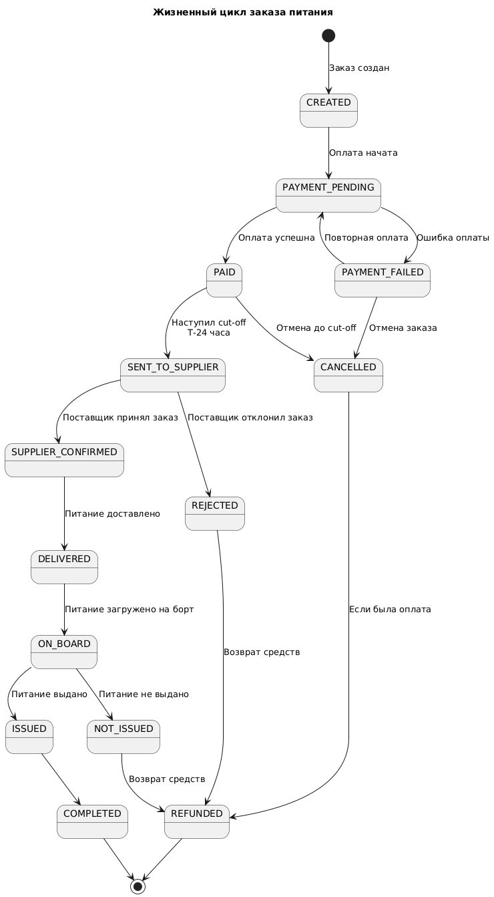
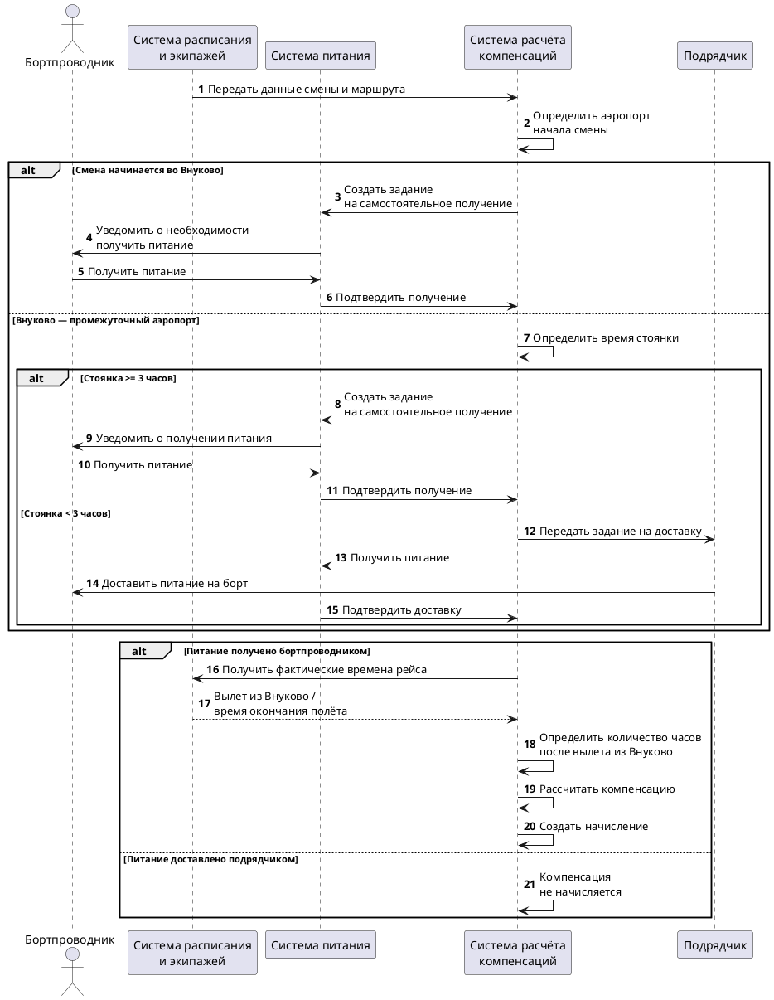
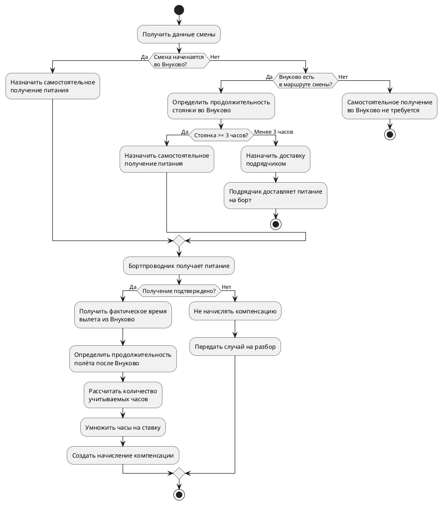

# Задача 1. «Заказ еды на борт»

В авиакомпании планируется ввести услугу «Заказ еды на борт». 

Клиент компании через официальный сайт сможет приобрести еду и напитки, которые ему предоставит бортпроводник в процессе выполнения рейса.  Услугу можно будет приобрести не позднее, чем за 24 часа до вылета. 

Поставщиком еды будет сторонняя компания. Поставщик получит заказ клиента и доставит его на борт к времени вылета. 

Опишите предполагаемую схему взаимодействий участников данного бизнес-процесса после ввода услуги в эксплуатацию. 

Каким данными должны обмениваться участники процесса и в какой момент времени?


## 1.1. Участники

| Участник | Роль |
|---|---|
| Клиент (пассажир) | Выбирает, оформляет и оплачивает заказ |
| Сайт авиакомпании | Интерфейс: проверка бронирования, меню, оформление, статус заказа. Бизнес-логики заказа не содержит |
| Система бронирования | Источник данных о бронировании, пассажире, рейсе. Сообщает об изменениях рейса |
| Система управления заказами питания | Создаёт и хранит заказы, меню и остатки, контролирует сроки и статусы, взаимодействует с платёжной системой и поставщиком |
| Платёжная система | Проведение платежей и возвратов |
| Поставщик питания (сторонняя компания) | Принимает заказ, подтверждает исполнимость, комплектует, доставляет в аэропорт |
| Наземная служба | Принимает питание в аэропорту, проверяет количество, передаёт на борт |
| Бортпроводник | Получает список заказов, выдаёт питание, фиксирует результат |
| Бухгалтерия | Получает реестр выполненных заказов для расчётов с поставщиком |


## 1.2. Основной сценарий

1. Клиент вводит на сайте номер бронирования и фамилию.
2. Сайт запрашивает данные бронирования в Системе бронирования и получает рейс, пассажира, место, статус.
3. Сайт проверяет, что бронирование активно и до вылета осталось не менее 24 часов. Иначе услуга недоступна.
4. Сайт запрашивает в Системе заказов меню для рейса и показывает его клиенту (цены, состав, аллергены, остатки).
5. Клиент выбирает позиции. Сайт передаёт их в Систему заказов.
6. Система заказов проверяет остатки и резервирует позиции, создаёт заказ (`CREATED`), считает сумму, возвращает `order_id` и срок действия неоплаченного заказа.
7. Клиент нажимает «Оплатить». Сайт запрашивает оплату у Системы заказов. Система заказов переводит заказ в `PAYMENT_PENDING`, создаёт платёж в Платёжной системе и возвращает сайту ссылку на оплату. Сайт перенаправляет клиента.
8. Платёжная система передаёт результат в Систему заказов (callback). Повторный callback игнорируется (идемпотентность по ID платежа).
   - Успех: `PAID`, сайт показывает подтверждение, клиент получает чек.
   - Ошибка: `PAYMENT_FAILED`, клиент может повторить оплату, если заказ ещё не истёк и до вылета осталось не менее 24 часов.
9. Если callback не пришёл в установленное время, Система заказов сама запрашивает статус платежа в Платёжной системе.

### 1.2.2 Изменение и отмена, если до времени вылета осталось не менее 24 часов

10. Клиент может отменить оплаченный заказ. Система заказов переводит его в `CANCELLED`, инициирует возврат по правилам, после чего заказ получает статус `REFUND_PENDING`, а после подтверждения возврата — `REFUNDED`.
11. Изменение состава заказа выполняется как отмена с возвратом и создание нового заказа.

### 1.2.3. Cut-off и передача поставщику

12. За 24 часа до вылета Система заказов закрывает приём заказов, оплаты и изменений. Неоплаченные заказы (`CREATED`, `PAYMENT_PENDING`, `PAYMENT_FAILED`) переводятся в `EXPIRED`, резервы снимаются.
13. Оплаченные заказы по рейсу передаются поставщику одной заявкой (статус `SENT_TO_SUPPLIER`).
14. Поставщик подтверждает заказ (`SUPPLIER_CONFIRMED`) или отклоняет его (`SUPPLIER_REJECTED`) полностью или по отдельным позициям. Если поставщик не ответил в установленный срок, Система заказов отправляет ему напоминание и уведомляет ответственного сотрудника авиакомпании.
15. При отказе клиенту сообщают о невозможности исполнения заказа и предлагают замену позиции. Если клиент согласен, заказ обновляется и снова уходит поставщику (`SUPPLIER_CONFIRMED` после подтверждения). Если нет, заказ получает статус `REFUND_PENDING`, выполняется возврат и заказ переходит в `REFUNDED`.

### 1.2.4. Изменение рейса

16. Система бронирования сообщает Системе заказов об изменении рейса (время, дата, самолёт, отмена рейса) или бронирования (отмена билета).
17. Система заказов оценивает возможность исполнения:
    - можно исполнить (например, небольшой сдвиг времени): обновляет данные для поставщика и наземной службы, уведомляет клиента;
    - нельзя исполнить (отмена рейса или билета, перенос на другую дату): заказ переводится в `CANCELLED` с причиной «по инициативе авиакомпании», поставщику и наземной службе уходит отмена, клиенту — уведомление и полный возврат.

### 1.2.5. Доставка и загрузка на борт

18. Поставщик комплектует заказ и доставляет питание в аэропорт к установленному сроку.
19. Наземная служба принимает питание, сверяет количество с заявкой и фиксирует факт: время и фактическое количество. Заказы получают статус `DELIVERED`. Заказы, по которым есть недопоставка, получают статус `DELIVERY_FAILED`, клиенту оформляется возврат.
20. Наземная служба передаёт питание экипажу, загружает его на борт и подтверждает загрузку в Системе заказов. Заказы получают статус `ON_BOARD`.


### 1.2.6. Выдача в полёте

21. Система заказов передаёт бортпроводнику список заказов рейса: `order_id`, пассажир, место, состав, особые требования. Список загружается на электронное устройство бортпроводника до вылета. В полёте связи с Системой заказов может не быть.
22. Бортпроводник выдаёт питание и отмечает на устройстве по каждому заказу «выдан» или «не выдан» с причиной.
23. После посадки устройство синхронизируется с Системой заказов, результаты передаются пакетом. Выданные заказы получают `ISSUED`, затем `COMPLETED`. Невыданные получают `NOT_ISSUED`, затем `REFUND_PENDING` и `REFUNDED` (по правилам компенсации).

### 1.2.7. Взаиморасчёты

24. После синхронизации результатов рейса Система заказов формирует реестр выполненных и невыполненных заказов: суммы, статусы, возвраты.
25. Реестр передаётся в Бухгалтерию, которая проводит расчёты с поставщиком только по фактически выполненным заказам.


## 1.3. Диаграмма последовательности


```
@startuml

autonumber

actor "Клиент" as C
participant "Сайт компании" as W
participant "Система бронирования" as P
participant "Система управления\nзаказами питания" as OMS
participant "Платёжная система" as PG
participant "Поставщик питания" as S
participant "Наземная служба" as G
actor "Бортпроводник" as F
participant "Бухгалтерия" as A

== Оформление заказа ==

C -> W: Номер бронирования, фамилия

W -> P: Запрос данных бронирования
P --> W: Данные бронирования,\nрейс, пассажир, место, статус

W -> W: Проверка возможности заказа\n время вылета > 24 ч

alt Заказ доступен

    W -> OMS: Запрос меню по рейсу
    OMS --> W: Доступные позиции,\nцены, состав, аллергены, остатки

    W --> C: Отображение меню

    C -> W: Выбор позиций

    W -> OMS: Создание заказа
    OMS -> OMS: Проверка остатков\nи резервирование позиций
    OMS -> OMS: Создание заказа CREATED

    OMS --> W: order_id, сумма, валюта,\nстатус CREATED,\nсрок действия заказа

    == Оплата ==

    C -> W: Нажатие «Оплатить»

    W -> OMS: Запрос на оплату\norder_id, сумма

    OMS -> OMS: CREATED -> PAYMENT_PENDING

    OMS -> PG: Инициация платежа\norder_id, сумма, валюта,\nidempotency_key

    PG --> OMS: URL/идентификатор оплаты

    OMS --> W: URL оплаты

    W --> C: Переход к оплате

    PG -> OMS: Callback результата оплаты\nID платежа, order_id,\nстатус, сумма, время

    alt Оплата успешна

        OMS -> OMS: PAYMENT_PENDING -> PAID
        OMS --> W: Статус PAID
        W --> C: Подтверждение заказа + чек

    else Ошибка оплаты

        OMS -> OMS: PAYMENT_PENDING -> PAYMENT_FAILED
        OMS --> W: Статус PAYMENT_FAILED
        W --> C: Ошибка оплаты,\nвозможность повторить

    end

    == Контроль платежа ==

    opt Callback не получен в установленный срок

        OMS -> PG: Запрос статуса платежа\nID платежа
        PG --> OMS: Текущий статус платежа

        alt Платёж успешен
            OMS -> OMS: PAYMENT_PENDING -> PAID

        else Платёж неуспешен
            OMS -> OMS: PAYMENT_PENDING -> PAYMENT_FAILED
        end

    end

else Заказ недоступен

    W --> C: Услуга недоступна

end


== Отмена / изменение заказа до времени вылета не менее 24 часов ==

opt Клиент отменяет оплаченный заказ

    C -> W: Отмена заказа
    W -> OMS: Запрос отмены\norder_id

    OMS -> OMS: PAID -> CANCELLED

    OMS -> PG: Запрос возврата\norder_id, сумма, idempotency_key
    OMS -> OMS: CANCELLED -> REFUND_PENDING

    PG --> OMS: Callback результата возврата

    alt Возврат выполнен

        OMS -> OMS: REFUND_PENDING -> REFUNDED

    else Возврат не выполнен

        OMS -> OMS: Ожидание повторной обработки

    end

    OMS --> W: Статус заказа
    W --> C: Подтверждение отмены и возврата

end


opt Клиент изменяет состав заказа

    C -> W: Изменение состава
    W -> OMS: Запрос отмены текущего заказа

    OMS -> OMS: PAID -> CANCELLED

    OMS -> PG: Запрос возврата\nidempotency_key
    OMS -> OMS: CANCELLED -> REFUND_PENDING

    PG --> OMS: Callback результата возврата

    OMS -> OMS: REFUND_PENDING -> REFUNDED

    W -> OMS: Создание нового заказа

    OMS -> OMS: Проверка остатков\nи резервирование позиций
    OMS -> OMS: Создание заказа CREATED

    OMS --> W: Новый order_id,\nсумма, статус CREATED,\nсрок действия заказа

end


== Закрытие продаж. До вылета осталось 24 часа ==

OMS -> OMS: Наступление cut-off 

OMS -> OMS: Закрытие приёма новых заказов,\nоплаты и изменений

OMS -> OMS: CREATED/PAYMENT_PENDING/\nPAYMENT_FAILED -> EXPIRED

OMS -> OMS: Снятие резервов

OMS -> S: Передача единой заявки по рейсу

note right of S
Заявка содержит:
рейс, дату/время вылета,
аэропорт, список заказов,
пассажиров и места,
позиции и количество,
особые требования,
время и место доставки
end note

S --> OMS: Подтверждение получения заявки

alt Поставщик подтверждает исполнение

    S --> OMS: SUPPLIER_CONFIRMED

    OMS -> OMS: Заказы -> SENT_TO_SUPPLIER\n-> SUPPLIER_CONFIRMED

else Полный или частичный отказ

    S --> OMS: SUPPLIER_REJECTED\nили список отклонённых позиций

    OMS --> W: Информация о недоступных позициях
    W --> C: Уведомление + варианты замены

    alt Клиент согласен на замену

        C -> W: Выбор замены
        W -> OMS: Обновление состава заказа

        OMS -> S: Обновлённая заявка
        S --> OMS: Подтверждение изменений

        OMS -> OMS: Позиции -> SUPPLIER_CONFIRMED

    else Клиент отказывается от замены

        W -> OMS: Отказ от замены

        OMS -> OMS: Заказ -> REFUND_PENDING

        OMS -> PG: Запрос возврата\nidempotency_key
        PG --> OMS: Callback результата возврата

        OMS -> OMS: REFUND_PENDING -> REFUNDED

        OMS --> W: Статус возврата
        W --> C: Подтверждение возврата

    end

else Нет ответа в установленный срок

    OMS -> S: Напоминание о подтверждении
    OMS -> OMS: Эскалация ответственному\nсотруднику авиакомпании

end


== Изменение рейса / бронирования ==

opt Система бронирования сообщает об изменении

    P -> OMS: Изменение бронирования/рейса\nID бронирования, рейс,\nновая дата/время, аэропорт,\nсамолёт, статус

    OMS -> OMS: Проверка возможности\nисполнения заказа

    alt Заказ можно исполнить

        OMS -> S: Обновление данных заявки\nновые данные рейса/доставки
        S --> OMS: Подтверждение изменений

        OMS -> G: Обновление данных доставки

        OMS --> W: Обновлённые данные заказа
        W --> C: Уведомление об изменении

    else Заказ исполнить невозможно

        OMS -> S: Отмена заказа
        OMS -> G: Отмена/обновление заявки\nна доставку

        OMS -> OMS: Заказ -> CANCELLED

        OMS -> PG: Запрос полного возврата\nidempotency_key
        OMS -> OMS: CANCELLED -> REFUND_PENDING

        PG --> OMS: Callback результата возврата

        OMS -> OMS: REFUND_PENDING -> REFUNDED

        OMS --> W: Заказ отменён
        W --> C: Уведомление + полный возврат

    end

end


== Комплектация и доставка ==

S -> S: Комплектация питания

S -> G: Доставка питания в аэропорт\nID заявки/партии, рейс,\nколичество, плановое время

G -> G: Проверка количества\nи состава питания

G --> OMS: Результат приёмки\nID заявки/партии,\nфактическое время,\nфактически принятое количество

alt Все заказы доставлены полностью

    OMS -> OMS: Заказы -> DELIVERED

else Есть недоставленные заказы

    OMS -> OMS: Полностью доставленные\nзаказы -> DELIVERED

    OMS -> OMS: Недоставленные заказы\n-> DELIVERY_FAILED

    OMS -> PG: Запрос возврата\nпо недоставленным заказам

    OMS -> OMS: DELIVERY_FAILED -> REFUND_PENDING

    PG --> OMS: Callback результата возврата

    OMS -> OMS: REFUND_PENDING -> REFUNDED

    OMS --> W: Информация о недоставке
    W --> C: Уведомление + возврат

end


== Загрузка на борт ==

G -> F: Передача питания на борт\nРейс, список заказов,\nместа, состав, количество

F --> G: Подтверждение получения

G -> OMS: Подтверждение загрузки\nна борт

OMS -> OMS: DELIVERED -> ON_BOARD


== Подготовка к выдаче ==

OMS -> F: Список заказов рейса\norder_id, пассажир,\nместо, состав,\nособые требования

note right of F
Список загружается на устройство
до вылета.
В полёте связь с OMS
может отсутствовать.
end note


== Выдача в полёте ==

F -> C: Выдача питания

F -> F: Фиксация результата\nна устройстве

alt Заказ выдан

    F -> F: ISSUED

else Заказ не выдан

    F -> F: NOT_ISSUED\n+ причина невыдачи

end


== Синхронизация после посадки ==

F -> OMS: Пакет результатов выдачи\norder_id, статус, время,\nпричина невыдачи

alt Заказ выдан

    OMS -> OMS: ON_BOARD -> ISSUED
    OMS -> OMS: ISSUED -> COMPLETED

else Заказ не выдан

    OMS -> OMS: ON_BOARD -> NOT_ISSUED
    OMS -> OMS: NOT_ISSUED -> REFUND_PENDING

    OMS -> PG: Запрос возврата\nпо правилам компенсации\nidempotency_key

    PG --> OMS: Callback результата возврата

    OMS -> OMS: REFUND_PENDING -> REFUNDED

end


== Взаиморасчёты ==

OMS -> OMS: Формирование реестра\nпосле завершения рейса

OMS -> A: Реестр заказов,\nстатусы выполнения,\nсуммы, возвраты

A -> S: Данные для взаиморасчётов\nвыполненные заказы,\nсумма к оплате

@enduml

```

## 1.4. Какими данными обмениваются системы
| № | Момент | От → Кому | Данные |
|---|---|---|---|
| 1 | Начало оформления | Клиент → Сайт | Номер бронирования, фамилия |
| 2 | Проверка бронирования | Сайт → Система бронирования | Номер бронирования, фамилия |
| 3 | Ответ по бронированию | Система бронирования → Сайт | ID бронирования, ID пассажира, номер рейса, дата/время вылета, аэропорты, место, класс обслуживания, статус |
| 4 | Запрос меню | Сайт → Система заказов | ID рейса, дата/время вылета |
| 5 | Отображение меню | Система заказов → Сайт | ID позиции, название, описание, цена, состав, аллергены, доступное количество |
| 6 | Создание заказа | Сайт → Система заказов | ID бронирования, ID пассажира, ID рейса, место, выбранные позиции, количество |
| 7 | Ответ при создании | Система заказов → Сайт | ID заказа, сумма, валюта, статус, срок действия неоплаченного заказа |
| 8 | Инициация оплаты | Система заказов → Платёжная система | ID заказа, сумма, валюта, идентификатор операции, idempotency key |
| 9 | Ссылка на оплату | Платёжная система → Система заказов → Сайт | URL/идентификатор платежа |
| 10 | Результат оплаты | Платёжная система → Система заказов | ID платежа, ID заказа, статус, сумма, время операции, идентификатор транзакции |
| 11 | Подтверждение заказа | Система заказов → Сайт | ID заказа, состав, сумма, рейс, место, статус |
| 12 | Запрос статуса платежа | Система заказов → Платёжная система | ID платежа, ID заказа |
| 13 | Возврат | Система заказов → Платёжная система | ID заказа, ID платежа, сумма возврата, причина, idempotency key |
| 14 | Результат возврата | Платёжная система → Система заказов | ID возврата, ID заказа, статус, сумма, время операции |
| 15 | Передача поставщику | Система заказов → Поставщик | ID заявки, номер рейса, дата/время вылета, аэропорт, список заказов, пассажиры, места, состав и количество позиций, специальные требования, время и место доставки |
| 16 | Подтверждение поставщика | Поставщик → Система заказов | ID заявки/заказа, статус принятия, время подтверждения, подтверждённые/отклонённые позиции, причина отказа |
| 17 | Изменение рейса | Система бронирования → Система заказов | ID рейса/бронирования, новый статус, новая дата/время, аэропорт, сведения об изменении самолёта |
| 18 | Изменение заказа | Система заказов → Поставщик | ID заявки/заказов, новые данные рейса, изменённый состав/количество либо признак отмены |
| 19 | Обновление наземной доставки | Система заказов → Наземная служба | ID заявки/партии, рейс, новое время/место доставки, состав и количество |
| 20 | Доставка | Поставщик → Наземная служба | ID заявки/партии, рейс, состав и количество питания, идентификатор груза, плановое время доставки |
| 21 | Подтверждение приёмки | Наземная служба → Система заказов | ID заявки/партии, статус, фактическое время, фактически принятое количество, перечень недоставленных заказов |
| 22 | Передача на борт | Наземная служба → Бортпроводник | Рейс, список заказов, ID заказов, места, состав и количество |
| 23 | Список для выдачи | Система заказов → Устройство бортпроводника | ID заказа, пассажир, место, состав, особые требования |
| 24 | Результат выдачи | Устройство бортпроводника → Система заказов | ID заказа, статус «Выдан» / «Не выдан», причина невыдачи, время выдачи |
| 25 | После завершения рейса | Система заказов → Бухгалтерия | Реестр заказов, статусы выполнения, суммы заказов, суммы возвратов |
| 26 | Взаиморасчёты | Бухгалтерия → Поставщик | Реестр выполненных заказов, сумма к оплате, данные для сверки |


## 1.5. Статусы заказа



```
@startuml

title Жизненный цикл заказа питания

[*] --> CREATED : Заказ создан

CREATED --> PAYMENT_PENDING : Инициация оплаты
CREATED --> EXPIRED : Истёк срок оплаты 

PAYMENT_PENDING --> PAID : Оплата успешна
PAYMENT_PENDING --> PAYMENT_FAILED : Ошибка оплаты
PAYMENT_PENDING --> EXPIRED :  Заказ не оплачен и время вылета не менее 24 часов

PAYMENT_FAILED --> PAYMENT_PENDING : Повторная попытка оплаты
PAYMENT_FAILED --> EXPIRED : Заказ не оплачен и время вылета не менее 24 часов

PAID --> CANCELLED : Отмена до cut-off
PAID --> SENT_TO_SUPPLIER : Передача заявки поставщику ровно на 24 до вылета

CANCELLED --> REFUND_PENDING : Инициирован возврат

SENT_TO_SUPPLIER --> SUPPLIER_CONFIRMED : Поставщик подтвердил
SENT_TO_SUPPLIER --> SUPPLIER_REJECTED : Полный/частичный отказ

SUPPLIER_REJECTED --> REFUND_PENDING : Нет замены / возврат

SUPPLIER_CONFIRMED --> DELIVERED : Питание принято наземной службой

DELIVERED --> DELIVERY_FAILED : Заказ не доставлен
DELIVERY_FAILED --> REFUND_PENDING : Инициирован возврат

DELIVERED --> ON_BOARD : Питание загружено на борт

ON_BOARD --> ISSUED : Питание выдано
ON_BOARD --> NOT_ISSUED : Питание не выдано

ISSUED --> COMPLETED : Завершение заказа
NOT_ISSUED --> REFUND_PENDING : Инициирован возврат

REFUND_PENDING --> REFUNDED : Возврат подтверждён

REFUNDED --> [*]
COMPLETED --> [*]
EXPIRED --> [*]

@enduml
```

### Правила переходов

- `CREATED` — заказ создан, но оплата ещё не завершена.
- `PAYMENT_PENDING` — ожидается результат оплаты.
- `PAID` — оплата успешно подтверждена.
- `PAYMENT_FAILED` — оплата завершилась ошибкой; разрешена повторная попытка.
- `CANCELLED` — заказ отменён до передачи поставщику.
- `SENT_TO_SUPPLIER` — заказ передан поставщику.
- `SUPPLIER_CONFIRMED` — поставщик подтвердил возможность исполнения.
- `SUPPLIER_REJECTED` — поставщик не может выполнить заказ.
- `DELIVERED` — питание принято наземной службой.
- `ON_BOARD` — питание загружено на борт.
- `ISSUED` — питание выдано пассажиру.
- `NOT_ISSUED` — питание не выдано; причина фиксируется.
- `COMPLETED` — заказ успешно исполнен.
- `REFUNDED` — по заказу выполнен возврат денежных средств.

При необходимости можно дополнительно хранить отдельные статусы оплаты, доставки и выдачи, чтобы не перегружать жизненный цикл заказа техническими состояниями.

## 1.6. Ключевые решения 

- Заказ можно оформить не позднее чем за 24 часа до планового времени вылета.
- Если время вылета менее 24 часов, новые заказы, оплаты и изменения существующих заказов не принимаются.
- Неоплаченные заказы при времени вылета менее 24 часов переводятся в `EXPIRED`, резервы снимаются.
- Заказ связан с конкретным бронированием, пассажиром и рейсом.
- Передача заказа поставщику выполняется только после успешной оплаты.
- Для заказа используется уникальный `order_id`, позволяющий идентифицировать заказ и предотвращать его дублирование.
- Результат оплаты передаётся в систему управления заказами через callback от платёжной системы.
- Если callback об оплате не получен в установленный срок, система управления заказами запрашивает статус платежа у платёжной системы.
- Повторный callback по одной операции не должен приводить к повторному изменению статуса или повторному возврату денежных средств.
- Операции оплаты и возврата должны быть идемпотентными.
- Поставщик должен подтвердить получение заявки и возможность её исполнения.
- При частичном отказе поставщика недоступные позиции обрабатываются отдельно: клиенту предлагается замена либо выполняется возврат по недоступным позициям.
- При изменении рейса система управления заказами повторно проверяет возможность исполнения заказа. Если исполнение невозможно, заказ отменяется и выполняется возврат согласно правилам.
- При доставке фиксируются плановое и фактическое время, количество переданных комплектов и идентификатор заказа/партии.
- Бортпроводник получает список заказов до вылета; в полёте работа устройства может выполняться offline.
- По каждому заказу фиксируется результат выдачи и причина невыдачи, если питание не было выдано.
- Для каждого изменения статуса хранятся время изменения и источник изменения.
- Взаиморасчёты с поставщиком выполняются на основании фактически выполненных заказов и согласованных правил расчёта.


## Задача 2. Начисление компенсации за доставку питания пилотов

В ряде случаев бортпроводники перед первым рейсом в смене и во время стоянки между рейсами в аэропорту Внуково забирают питание для пилотов и приносят его на борт. За это бортпроводникам начисляется денежная компенсация. 

Процесс должен удовлетворять ряду условий:

•	Если смена начинается во Внуково, то бортпроводник должен получить питание для пилотов

•	Если Внуково является промежуточным аэропортом и стоянка во Внуково более трех часов, то бортпроводник должен получить питание для пилотов

•	Если Внуково является промежуточным аэропортом и стоянка во Внуково менее трех часов, то питание доставляется на борт через подрядчика.

•	Если бортпроводник получает питание для пилотов самостоятельно, то ему производится фиксированное начисление денежной компенсации за каждый час полета. Считаются только часы, которые наступили после вылета из Внуково
Необходимо построить процесс начисления денежной компенсации бортпроводнику за доставку питания на борт.


## 1. Цель

Необходимо автоматизировать процесс определения способа доставки питания для пилотов во Внуково и начисления денежной компенсации бортпроводнику в случае, если он самостоятельно получает питание и доставляет его на борт.


## 2. Участники и системы

| Участник / система                | Ответственность                                                                                    |
| --------------------------------- | -------------------------------------------------------------------------------------------------- |
| **Система расписания и экипажей** | Предоставляет данные о сменах экипажа, маршруте, аэропортах и времени рейсов                       |
| **Система питания**               | Хранит информацию о питании пилотов и фиксирует факт его получения                                 |
| **Бортпроводник**                 | Самостоятельно получает питание во Внуково и доставляет его на борт                                |
| **Подрядчик**                     | Доставляет питание на борт, если по условиям процесса бортпроводник не получает его самостоятельно |
| **Система расчёта компенсаций**   | Определяет право на компенсацию, рассчитывает её размер и формирует начисление                     |


# 3. Бизнес-правила

## 3.1. Определение способа доставки

| ID    | Условие                                                               | Способ доставки                                    | Компенсация |
| ----- | --------------------------------------------------------------------- | -------------------------------------------------- | ----------- |
| BR-01 | Смена бортпроводника начинается во Внуково                            | Бортпроводник получает питание самостоятельно      | Да          |
| BR-02 | Внуково является промежуточным аэропортом, стоянка **3 часа и более** | Бортпроводник получает питание самостоятельно      | Да          |
| BR-03 | Внуково является промежуточным аэропортом, стоянка **менее 3 часов**  | Питание доставляется подрядчиком                   | Нет         |
| BR-04 | Бортпроводник самостоятельно получает питание                         | Рассчитывается денежная компенсация                | Да          |
| BR-05 | Питание доставляет подрядчик                                          | Денежная компенсация бортпроводнику не начисляется | Нет         |

## 3.2. Расчёт компенсации

Если питание получает бортпроводник самостоятельно:

**Компенсация = количество часов полёта после вылета из Внуково × фиксированная ставка за час**

При расчёте учитываются только часы, которые наступили **после вылета из Внуково**.

# 4. Допущения

В исходном ТЗ не определены несколько деталей, поэтому для построения однозначного процесса принимаются следующие допущения.

### A-01. Момент определения способа доставки

Способ доставки определяется на основании **планового расписания**, поскольку решение о получении питания должно быть известно до соответствующего рейса.

### A-02. Начало смены

Смена считается начинающейся во Внуково, если аэропорт начала смены бортпроводника — Внуково.

### A-03. Промежуточный аэропорт

Внуково считается промежуточным аэропортом, если бортпроводник прибывает во Внуково в рамках смены и далее продолжает работу на следующем рейсе.

### A-04. Продолжительность стоянки

Продолжительность стоянки определяется как интервал между **фактическим временем прибытия во Внуково и фактическим временем вылета из Внуково**.

Если на этапе планирования используются только плановые времена, в системе может быть предварительно рассчитано ожидаемое решение, а после появления фактических времён оно может быть пересчитано. В рамках данного ТЗ для определения правила используется фактическая стоянка.

### A-05. Фиксированная ставка

Размер компенсации за один час полёта является параметром системы:

`hourly_rate`

Конкретное значение ставки в ТЗ не задано.

### A-06. Определение количества часов

Для расчёта используется продолжительность полёта после вылета из Внуково.

Если результат содержит неполный час, способ округления в ТЗ не определён.

В рамках допущения система хранит продолжительность в минутах и применяет отдельное правило округления, заданное параметром системы.

### A-07. Факт самостоятельного получения питания

Право на компенсацию возникает только после подтверждения факта, что питание действительно было получено бортпроводником самостоятельно.

Само наличие условия для самостоятельного получения питания не является достаточным основанием для начисления.

### A-08. Отмена начисления

Если самостоятельное получение питания не состоялось, компенсация не начисляется.

### A-09. Несколько рейсов после Внуково

Если после вылета из Внуково в рамках одной смены выполняется несколько рейсов, для расчёта учитываются часы полёта после вылета из Внуково согласно периоду, предусмотренному правилами компенсации.

### A-10. Стоянка ровно три часа
Если Внуково является промежуточным аэропортом, стоянка **3 часа и более**, то Бортпроводник получает питание самостоятельно  


# 5. Основной процесс

## 5.1. Определение необходимости самостоятельного получения питания

1. Система получает данные о смене бортпроводника.
2. Определяется аэропорт начала смены.
3. Если смена начинается во Внуково:

   * бортпроводнику назначается получение питания;
   * способ доставки = `САМОСТОЯТЕЛЬНО`.
4. Если смена начинается не во Внуково:

   * система проверяет маршрут смены;
   * определяется наличие промежуточной стоянки во Внуково.
5. Если Внуково является промежуточным аэропортом:

   * рассчитывается продолжительность стоянки.
6. Если стоянка **3 часа или более**:

   * способ доставки = `САМОСТОЯТЕЛЬНО`.
7. Если стоянка **менее 3 часов**:

   * способ доставки = `ПОДРЯДЧИК`.

# 5.2. Процесс самостоятельного получения питания

Если выбран способ доставки `САМОСТОЯТЕЛЬНО`:

1. Система питания формирует задание на получение питания.
2. Бортпроводник получает питание во Внуково.
3. Система питания фиксирует:

   * бортпроводника;
   * дату и время получения;
   * рейс / смену;
   * факт получения.
4. Бортпроводник доставляет питание на борт.
5. После подтверждения факта получения система расчёта компенсаций получает данные для расчёта.
6. Система определяет период полёта после вылета из Внуково.
7. Определяется количество учитываемых часов.
8. Выполняется расчёт компенсации.
9. Создаётся начисление.


# 5.3 Процесс доставки подрядчиком

Если Внуково является промежуточным аэропортом и стоянка менее 3 часов:

1. Система определяет способ доставки `ПОДРЯДЧИК`.
2. Формируется задание подрядчику.
3. Подрядчик получает питание.
4. Подрядчик доставляет питание на борт.
5. Бортпроводник не получает питание самостоятельно.
6. Компенсация бортпроводнику за самостоятельную доставку не начисляется.


# 8. Расчёт компенсации

## Формула

```text
Компенсация = Количество учитываемых часов × Ставка за час
```

где:

```text
Количество учитываемых часов =
продолжительность полёта после вылета из Внуково
```


# 9. Модель данных

Для реализации процесса системе необходимо иметь как минимум следующие данные.

### Смена

| Поле                  | Описание                     |
| --------------------- | ---------------------------- |
| `shift_id`            | Идентификатор смены          |
| `employee_id`         | Идентификатор бортпроводника |
| `shift_start_airport` | Аэропорт начала смены        |

### Рейс

| Поле                  | Описание                  |
| --------------------- | ------------------------- |
| `flight_id`           | Идентификатор рейса       |
| `departure_airport`   | Аэропорт вылета           |
| `arrival_airport`     | Аэропорт прилёта          |
| `scheduled_departure` | Плановое время вылета     |
| `scheduled_arrival`   | Плановое время прилёта    |
| `actual_departure`    | Фактическое время вылета  |
| `actual_arrival`      | Фактическое время прилёта |

### Получение питания

| Поле                   | Описание                           |
| ---------------------- | ---------------------------------- |
| `meal_delivery_id`     | Идентификатор задания              |
| `flight_id`            | Рейс                               |
| `employee_id`          | Бортпроводник                      |
| `delivery_method`      | Способ доставки                    |
| `received_at`          | Время получения                    |
| `received_by_employee` | Признак самостоятельного получения |

### Компенсация

| Поле              | Описание                     |
| ----------------- | ---------------------------- |
| `compensation_id` | Идентификатор начисления     |
| `employee_id`     | Бортпроводник                |
| `flight_id`       | Рейс / основание             |
| `hours`           | Количество учитываемых часов |
| `hourly_rate`     | Ставка за час                |
| `amount`          | Сумма компенсации            |
| `status`          | Статус начисления            |

---

# 10. Состояния задания на доставку

@startuml

[*] --> CREATED

CREATED --> DELIVERY_METHOD_DEFINED

DELIVERY_METHOD_DEFINED --> SELF_PICKUP : Бортпроводник
DELIVERY_METHOD_DEFINED --> CONTRACTOR : Подрядчик

SELF_PICKUP --> RECEIVED : Получение подтверждено
RECEIVED --> ON_BOARD : Доставлено на борт

ON_BOARD --> COMPENSATION_CALCULATED
COMPENSATION_CALCULATED --> COMPENSATION_CREATED

CONTRACTOR --> DELIVERED : Доставлено на борт

DELIVERED --> [*]
COMPENSATION_CREATED --> [*]

@enduml


# 11. Основные сценарии

## Сценарий 1. Смена начинается во Внуково

**Входные данные:**

* аэропорт начала смены = Внуково.

**Результат:**

* бортпроводник получает питание самостоятельно;
* после подтверждения получения рассчитывается компенсация;
* компенсация начисляется за учитываемые часы полёта после вылета из Внуково.


## Сценарий 2. Внуково — промежуточный аэропорт, стоянка 3 часа и более

**Входные данные:**

* Внуково является промежуточным аэропортом;
* продолжительность стоянки ≥ 3 часов.

**Результат:**

* бортпроводник самостоятельно получает питание;
* после подтверждения получения рассчитывается компенсация.


## Сценарий 3. Внуково — промежуточный аэропорт, стоянка менее 3 часов

**Входные данные:**

* Внуково является промежуточным аэропортом;
* продолжительность стоянки < 3 часов.

**Результат:**

* питание доставляет подрядчик;
* самостоятельного получения бортпроводником нет;
* компенсация бортпроводнику не начисляется.

## Сценарий 4. Самостоятельное получение не подтверждено

**Входные данные:**

* по правилам бортпроводник должен был получить питание самостоятельно;
* факт получения отсутствует.

**Результат:**

* компенсация не начисляется;
* случай может быть передан на разбор ответственному сотруднику.

# 12. Диаграмма последовательности




# 13. Диаграмма бизнес-процесса




# 14. Матрица решений

| Условие | Смена начинается во Внуково | Внуково промежуточный | Стоянка | Способ доставки | Компенсация |
| ------- | --------------------------: | --------------------: | ------: | --------------- | ----------- |
| 1       |                          Да |                     — |       — | Бортпроводник   | Да          |
| 2       |                         Нет |                    Да |   ≥ 3 ч | Бортпроводник   | Да          |
| 3       |                         Нет |                    Да |   < 3 ч | Подрядчик       | Нет         |
| 4       |                         Нет |                   Нет |       — | Не требуется    | Нет         |

---

# 15. Ключевые проверки

Перед начислением компенсации система должна проверить:

1. Бортпроводник действительно относится к соответствующей смене.
2. Внуково является аэропортом начала смены либо промежуточным аэропортом.
3. Для промежуточного аэропорта выполнено условие по продолжительности стоянки.
4. Для самостоятельной доставки существует подтверждение фактического получения питания.
5. Определено фактическое время вылета из Внуково.
6. Определена продолжительность полёта после вылета из Внуково.
7. Для расчёта доступна актуальная ставка компенсации.
8. По данному основанию компенсация ещё не была начислена.

Последняя проверка необходима для защиты от **двойного начисления** при повторной обработке одного и того же события.


# 16. Идемпотентность начисления

При повторной обработке данных система не должна создавать несколько начислений за одну и ту же доставку.

Для этого начисление должно иметь уникальный бизнес-ключ:

```text
employee_id + shift_id + meal_delivery_id
```

Перед созданием начисления система проверяет наличие уже созданного начисления с таким ключом.

Если начисление существует:

```text
Новое начисление не создаётся.
```

Если начисления нет:

```text
Создаётся новое начисление.
```


# 17. Что необходимо уточнить у заказчика

Следующие вопросы непосредственно влияют на реализацию и не определены исходным ТЗ:

1. **Что считается часом для компенсации?**

   * полный час;
   * округление вверх;
   * округление вниз;
   * фактические минуты с пропорциональным расчётом.

2. **Какова фиксированная ставка за час?**

3. **Какие времена используются для расчёта стоянки?**

   * плановые;
   * фактические.

4. **Какие времена используются для расчёта часов полёта?**

   * плановые;
   * фактические.

5. **Что делать, если бортпроводник должен был получить питание, но фактически его не получил?**

6. **Что делать при отмене рейса после получения питания?**

7. **Как обрабатывается изменение маршрута или расписания после формирования задания?**

8. **До какого момента допускается изменение способа доставки?**

9. **За какой именно период начисляется компенсация, если после вылета из Внуково у бортпроводника несколько последующих рейсов в рамках одной смены?**

