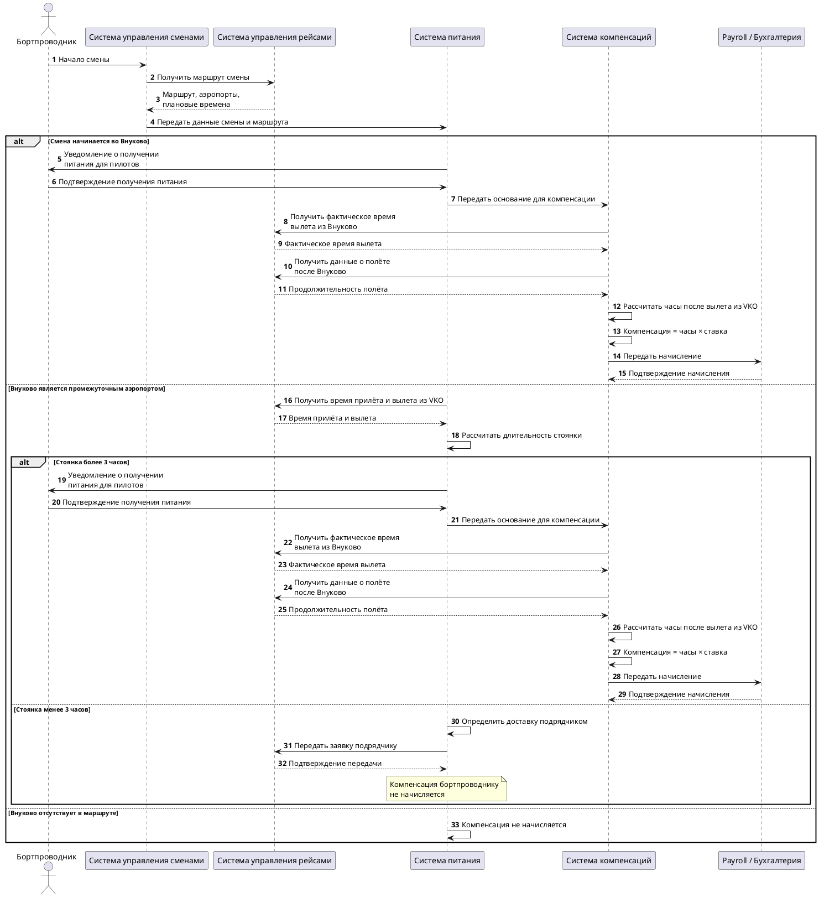

## Задача 1. «Заказ еды на борт»

В авиакомпании планируется ввести услугу «Заказ еды на борт». 

Клиент компании через официальный сайт сможет приобрести еду и напитки, которые ему предоставит бортпроводник в процессе выполнения рейса.  

Услугу можно будет приобрести не позднее, чем за 24 часа до вылета. 

Поставщиком еды будет сторонняя компания. 

Поставщик получит заказ клиента и доставит его на борт к времени вылета. 

Опишите предполагаемую схему взаимодействий участников данного бизнес-процесса после ввода услуги в эксплуатацию. 

Каким данными должны обмениваться участники процесса и в какой момент времени? 

### 1.1. Участники

| Участник | Роль |
|---|---|
| Клиент (пассажир) | Оформляет и оплачивает заказ |
| Сайт авиакомпании| Витрина, корзина, оформление заказа |
| База данных| Источник данных о брони, рейсе, пассажире, месте; статус регистрации |
| Платежная система | Оплата, возврат |
| Модуль управления заказами питания  | Хранение заказов, крайний срок, формирование заявок, статусы, сверка |
| Поставщик питания | Готовит и доставляет заказ на борт |
| Наземная служба | Прием питания, загрузка на борт |
| Бортпроводник | Принимает заказы на борту, выдаёт, фиксирует выдачу |
| Бухгалтерия | Расчеты с поставщиком, возвраты |

### 1.2. Основной сценарий
Клиент на сайте вводит номер бронирования и фамилию.
Сайт запрашивает данные о бронировании.
Проверяется, что рейс существует и до вылета осталось не менее 24 часов.
Клиент выбирает питание и напитки.
Система рассчитывает стоимость и создаёт заказ.
Клиент оплачивает заказ.
После успешной оплаты заказ передаётся поставщику.
Поставщик подтверждает получение заказа.
Поставщик готовит заказ и доставляет его в аэропорт к установленному времени.
Наземная служба принимает питание и передаёт информацию/заказ на борт.
Бортпроводник получает список заказов и выдаёт питание пассажирам.
Заказ переводится в статус «Выдан».

### 1.3. Диаграмма последовательности


https://www.plantuml.com/plantuml/uml/ZLL1InjT5Ds_Nt5nPVYKm4TNBefWCNGNo28RDwdDGgY9nDXr9ccr4jjKARH8gosbgsucsj79J381Vy5xVy5VqdFlcumlqr0gI39lxhtdddFFkrdVRzTQxOFT5wfsq6us3dQVrLjArRRRpHOjwNCTwr07UcAwIrJRfmsrX-YTxPszMgEDzz-qhqUcIphIYHxhAHudI0Wbk9eBFZKTHE6zV5wbiO74bdEnbm3sJTUSwXj4-MP0naEYPxew091laqf_P2KIukihSupQ4Q6ba0y4TY1PbLpI5xozbQePK6nwm1scCALCZbFKxw3Sr3B0_o_X44dSfb8RjFgOgck4egn7O3gaXujecy4AcLVuFaPwpC-gohbbv7x4iI0OZm30yHFJDw-TKgfCgodILxG-CjwAX3BL8iXtc0-uu6iVvGC-Nzbgy80Wa8UQDzmFaj2aI9QW7toAw3q0WtquorJIcw1TfYJ033FtrnWrcOEX--CVzFyZCaS0H9HqHq2Cy3RaL3q1hg2Q4sa0zDun130sKF6pFQ5PCceke_C4KmhD8TiBlHvAK9z9-O2EfQFhz91qCYE3BiE2CvWpT3haCT9SoL4gVoclVu8mQyK-BQDe3msF8IOzVKB8zba5_YoeScbk9hS8ZSs9xMAkZaFraYs442le3SGCxAMW_o0W7YAbcdjjqf-08Kfb0KKcsRM7eb242hYDydg4OSga8bgrmoWembygWrilb36urUoHmqvI7_Gv4zrWCc6sB5g5RdvGKFN6SwKQpNQTcY_hBQm2VRwulGVhqFsRizGuIdmMiebTaM4y-mYgk11THY46IGrQiSCp0-Y939bmvYBJKnKxeB_gdjA1ZGPyAwW8WoLYenWvLlx4LdOD1Cnn8PtLHJuyqqzc_frHWSWB8dRcZMDNrwAbciwNgIwq0f3pF9c3y19mu_7DdjN1LocQP5jXpaRM9PcO5tg8KyZkD0hqcS9XpeJ_mDFog70CM-b3jh1bOhbr3Ka8O6_5AbExUxSQS3fOuEHQBfINBTK9Gu7-RFzPJ4obn72RCdQHHJRbqG8u5WYK1KYfJM5YTqQMujvvwM-QQHdOZ2eB9wBWK5ZT_HINsrKEIp5GGExPNUnO-3slIllQ5aTqzXjWUkdlqxLQV2DbKG4QKJhCzcn1hKDv_Cp_1W00

### 1.4. Какими данными обмениваются системы

| # | Момент | От → Кому | Данные |
|---|---|---|---|
| 1 | Начало оформления | Клиент → Сайт | Номер бронирования, фамилия |
| 2 | Проверка брони | Сайт → База данных → Сайт | Номер рейса, дата и время вылета (UTC и местное), аэропорты, ФИО, место, класс обслуживания, статус билета, особые пометки (SSR: детское, диетическое) |
| 3 | Показ меню | База данных → Сайт | Меню по рейсу: позиции, цены, состав, аллергены, лимит и остаток, поставщик аэропорта вылета |
| 4 | Оплата | Сайт → Платежнная система → Сайт | ID заказа, сумма, валюта, статус платежа, чек |
| 5 | Подтверждение | Сайт → Клиент | Номер заказа, состав, сумма, рейс, условия отмены и возврата |
| 6 | Изменение / отмена (до вылета − 24 ч) | Клиент → Сайт → Платежная система | ID заказа, новые позиции или признак отмены, сумма возврата |
| 7 | Крайний срок(вылет − 24 ч) | База данных → Поставщик | ID заявки, рейс, дата и время вылета, аэропорт, тип самолета, позиции с количеством, диетические пометки, время и место доставки, контакты |
| 8 | После получения заявки | Поставщик → База данных | Статус: принято / отклонено по позициям, причины, плановое время доставки |
| 9 | Изменения по рейсу |База данных ↔ Поставщик, База данных → Клиент | Новое время вылета, отмена рейса, смена самолета, уточненная заявка |
| 10 | Доставка  | Поставщик → Наземная служба | Накладная: состав, количество, температурный режим, ID заявки |
| 11 | В полете | Бортпроводник → База данных | Статус по каждому заказу: выдано / не выдано (причина); данные передаются после посадки, если связи нет |
| 12 | После рейса | База данных → Бухгалтерия, Поставщик | Реестр выполненных заказов, акт сверки, суммы к оплате и к возврату |

### 1.5. Статусы заказа


https://www.plantuml.com/plantuml/uml/bLHDYzDG5DtVN_7MGZVYoeLCJ5ubaYOXJGLH2Q8p88mZQ6RVpe0VT54Gr9Nw5zhQQ3Kc_eNx_f7t45vAQehCekJTnpddddjpcgDN-UEN-VdpKygVvQV7YZ_obdzmnONyAZFddygybgjVN2gvNyfXYQVYFxmr5r9KybmGFRZsI0q6jvIRQ2VLdhgf-9E5ApFZMbWRm8ai1F3OkJ_IOPh5ElJyy0veNqIwv2N45LToUDCKHFlWHi3tzbdcqioaBCnRy7jfzcxe-85k10IzvHKSAwwjcfaJTR07RNyLqbhQrsRASBreLU2fJyHrGbS7jhsWVdC1QcVHQE__3x_XMZqvpmSlJavsy37QfL4sdiHnuEi4hC_YPYPJNUBrSMb93y_ImVKRoc3JC_JyXmj1MsHk50xzP2H6chaXoKkP_XsI8j4mKpbKPj49JRzeekzgDpqeLKifsUCQEUlAKKjjT8QJq6jqtYDjeZ75xYLySYXu0sbU4_MC0G5F1_uzdLWdRRYvm7vRO-85IwzfXmSx2hFRaPFqaU7ucvdAphytLDMyj1MYOYw8MYw4_F5uqkjXRURY0sNTPOHHcXraLVjK0jG6C1h5WPODajMuyZ9tcTpdVP0abRoLEQLxsVbJ8M4j53pvU51hfhsXe-Epf_Wq_GK0


### 1.6. Ключевые решения и допущения

- Заказ можно оформить не позднее чем за 24 часа до планового времени вылета.
- Заказ должен быть связан с конкретным бронированием, рейсом и пассажиром.
- Передача поставщику происходит только после успешной оплаты.
- При передаче заказа поставщику используется уникальный ID заказа, чтобы исключить дублирование.
- Поставщик должен подтвердить получение заказа.
- Заказ должен быть доставлен до установленного времени, чтобы питание оказалось на борту к вылету.
- Бортпроводник должен видеть, какому пассажиру и на каком месте предназначен конкретный заказ.
- После выдачи заказ переводится в финальный статус «Выдан».
- Для каждого изменения статуса желательно хранить время изменения и источник изменения.


---

## Задача 2. Начисление компенсации за доставку питания пилотов

### 2.1. Правила определения способа доставки

| Ситуация | Кто доставляет | Компенсация |
|---|---|---|
| Смена начинается во Внуково | Бортпроводник | Да |
| Внуково промежуточный, стоянка > 3 ч | Бортпроводник | Да |
| Внуково промежуточный, стоянка < 3 ч | Подрядчик | Нет |
| Внуково не задействован (нет вылета из VKO) | Не применимо | Нет |

Граничный случай: стоянка ровно 3 часа в условиях не описана. Предлагается считать «≥ 3 ч → бортпроводник» и согласовать с бизнесом.

### 2.2. Формула

```
Компенсация = Ставка_в_час × Часы_полёта_после_вылета_из_VKO
```

- Ставка фиксированная, хранится в справочнике с датой действия.
- Часы полёта: суммарное лётное время рейсов в смене, начиная с рейса, вылетающего из Внуково, для которого бортпроводник получил питание. Часы до этого вылета не считаются.
- Для расчёта берётся фактическое лётное время (по данным полётного задания или ACARS), а не плановое.
- Чтобы не было двойного начисления при нескольких стоянках во Внуково за смену, каждый период считается от своего вылета из VKO до следующего вылета из VKO или до конца смены.

### 2.3. Процесс

**Этап 1. Определение способа доставки питания**


**Этап 2. Получение питания и начисление**


### 2.4. Данные, необходимые для расчёта

| Источник | Данные |
|---|---|
| Система планирования экипажей | Бортпроводник, смена, последовательность рейсов, аэропорты, плановые время прилёта и вылета |
| Система операционного управления (факт) | Фактические время вылета и прилёта, лётное время по каждому сегменту, задержки |
| Приложение / бриф-лист | Назначение ответственного за питание, факт получения (отметка или акт с указанием рейса и времени) |
| Справочник ставок | Ставка за час, период действия |
| Расчёт зарплаты (ЗУП) | Принимает: ФИО, период, сумма, основание (смена, рейс, часы) |

### 2.5. Исключения и граничные случаи

- **Задержка или досрочный прилёт** меняет длительность стоянки. Решение о способе фиксируется за X часов до смены (уточнить X), после этого меняется только вручную с обоснованием.
- **Отмена рейса или замена бортпроводника:** компенсация только тому, кто фактически получил питание.
- **Питание не получено или получено, но не доставлено на борт:** компенсация не начисляется, случай идёт на разбор.
- **Несколько сегментов после VKO:** суммируются часы всех сегментов до конца смены или до следующего вылета из VKO.
- **Дублирование:** одно начисление на один вылет из Внуково с получением питания (ключ уникальности: бортпроводник + рейс + дата).


**Вопросы к бизнесу**

1. Что считается «часами полёта»: лётное время (воздух) или время в блоках?
2. Как округлять неполные часы?
3. Стоянка считается по плану или по факту?
4. Считаем только рейс, на котором получено питание, или все сегменты до конца смены?



