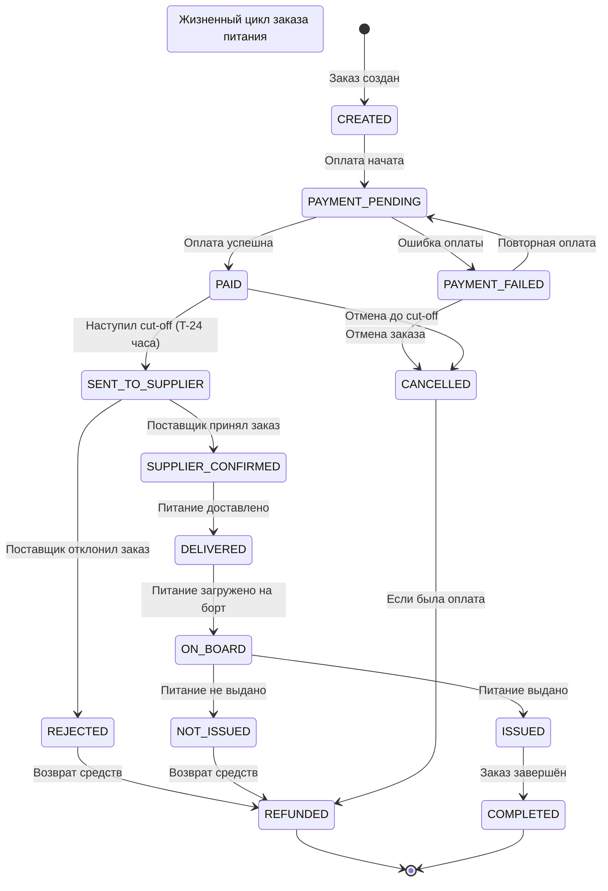
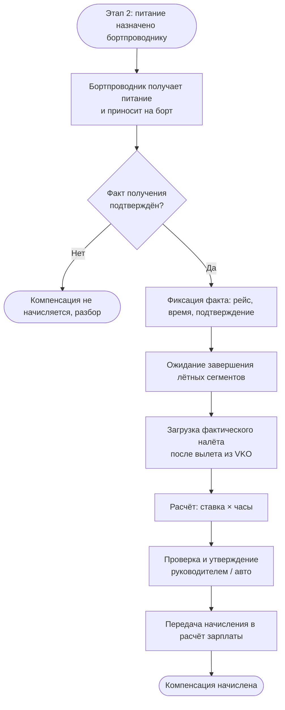
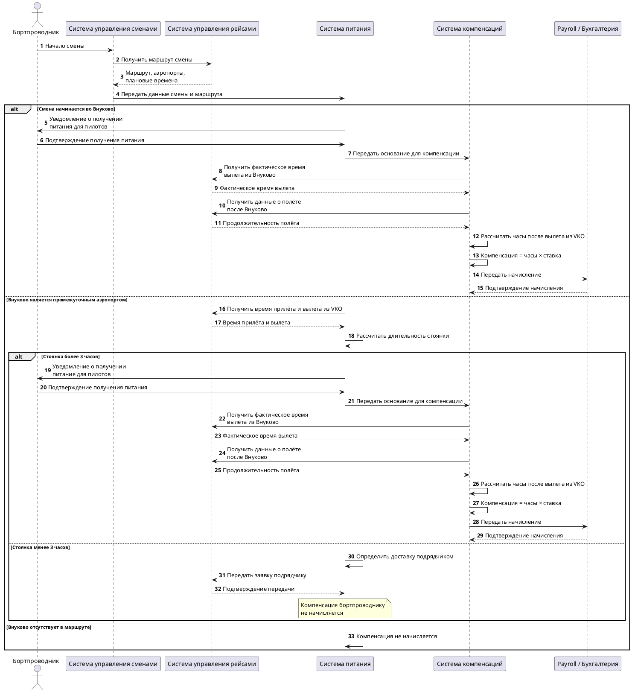

## Задача 1. «Заказ еды на борт»

В авиакомпании планируется ввести услугу «Заказ еды на борт». 

Клиент компании через официальный сайт сможет приобрести еду и напитки, которые ему предоставит бортпроводник в процессе выполнения рейса.  

Услугу можно будет приобрести не позднее, чем за 24 часа до вылета. 

Поставщиком еды будет сторонняя компания. 

Поставщик получит заказ клиента и доставит его на борт к времени вылета. 

Опишите предполагаемую схему взаимодействий участников данного бизнес-процесса после ввода услуги в эксплуатацию. 

Каким данными должны обмениваться участники процесса и в какой момент времени? 

### 1.1. Участники

| Участник | Роль |
|---|---|
| Клиент (пассажир) | Выбирает, оформляет и оплачивает заказ |
| Сайт авиакомпании | Отображает меню, позволяет оформить и оплатить заказ |
| Система бронирования | Предоставляет данные о бронировании, рейсе и пассажире |
| Система управления заказами питания | Создаёт и хранит заказы, контролирует сроки, статусы и взаимодействие с поставщиком |
| Платёжная система | Обрабатывает оплату и возвраты |
| Поставщик питания | Получает заказ, комплектует его и доставляет в аэропорт |
| Наземная служба | Принимает питание и обеспечивает его передачу на борт |
| Бортпроводник | Получает информацию о заказах и выдаёт питание пассажирам |
| Бухгалтерия | Получает данные о выполненных заказах для взаиморасчётов с поставщиком |

### 1.2. Основной сценарий

1. Клиент на сайте авиакомпании вводит номер бронирования и фамилию.
2. Сайт запрашивает в системе бронирования данные о бронировании.
3. Система проверяет наличие бронирования, пассажира и рейса.
4. Проверяется возможность оформления услуги: до планового времени вылета должно оставаться не менее 24 часов.
5. Клиенту отображается доступное меню для данного рейса.
6. Клиент выбирает еду и напитки.
7. Система управления заказами создаёт заказ и рассчитывает его стоимость.
8. Клиент оплачивает заказ через платёжную систему.
9. После успешной оплаты заказ получает статус «Оплачен».
10. Система управления заказами передаёт заказ поставщику питания.
11. Поставщик подтверждает получение заказа.
12. Поставщик комплектует заказ и доставляет его в аэропорт к установленному времени.
13. Наземная служба принимает заказ и обеспечивает его загрузку на борт.
14. Бортпроводник получает список заказов на рейс.
15. В процессе выполнения рейса бортпроводник выдаёт питание пассажирам.
16. После выдачи информация о результате фиксируется в системе.
17. После завершения рейса данные о выполненных заказах передаются для взаиморасчётов с поставщиком.
### 1.3. Диаграмма последовательности


https://www.plantuml.com/plantuml/uml/ZLL1InjT5Ds_Nt5nPVYKm4TNBefWCNGNo28RDwdDGgY9nDXr9ccr4jjKARH8gosbgsucsj79J381Vy5xVy5VqdFlcumlqr0gI39lxhtdddFFkrdVRzTQxOFT5wfsq6us3dQVrLjArRRRpHOjwNCTwr07UcAwIrJRfmsrX-YTxPszMgEDzz-qhqUcIphIYHxhAHudI0Wbk9eBFZKTHE6zV5wbiO74bdEnbm3sJTUSwXj4-MP0naEYPxew091laqf_P2KIukihSupQ4Q6ba0y4TY1PbLpI5xozbQePK6nwm1scCALCZbFKxw3Sr3B0_o_X44dSfb8RjFgOgck4egn7O3gaXujecy4AcLVuFaPwpC-gohbbv7x4iI0OZm30yHFJDw-TKgfCgodILxG-CjwAX3BL8iXtc0-uu6iVvGC-Nzbgy80Wa8UQDzmFaj2aI9QW7toAw3q0WtquorJIcw1TfYJ033FtrnWrcOEX--CVzFyZCaS0H9HqHq2Cy3RaL3q1hg2Q4sa0zDun130sKF6pFQ5PCceke_C4KmhD8TiBlHvAK9z9-O2EfQFhz91qCYE3BiE2CvWpT3haCT9SoL4gVoclVu8mQyK-BQDe3msF8IOzVKB8zba5_YoeScbk9hS8ZSs9xMAkZaFraYs442le3SGCxAMW_o0W7YAbcdjjqf-08Kfb0KKcsRM7eb242hYDydg4OSga8bgrmoWembygWrilb36urUoHmqvI7_Gv4zrWCc6sB5g5RdvGKFN6SwKQpNQTcY_hBQm2VRwulGVhqFsRizGuIdmMiebTaM4y-mYgk11THY46IGrQiSCp0-Y939bmvYBJKnKxeB_gdjA1ZGPyAwW8WoLYenWvLlx4LdOD1Cnn8PtLHJuyqqzc_frHWSWB8dRcZMDNrwAbciwNgIwq0f3pF9c3y19mu_7DdjN1LocQP5jXpaRM9PcO5tg8KyZkD0hqcS9XpeJ_mDFog70CM-b3jh1bOhbr3Ka8O6_5AbExUxSQS3fOuEHQBfINBTK9Gu7-RFzPJ4obn72RCdQHHJRbqG8u5WYK1KYfJM5YTqQMujvvwM-QQHdOZ2eB9wBWK5ZT_HINsrKEIp5GGExPNUnO-3slIllQ5aTqzXjWUkdlqxLQV2DbKG4QKJhCzcn1hKDv_Cp_1W00

### 1.4. Какими данными обмениваются системы

| № | Момент | От → Кому | Данные |
|---|---|---|---|
| 1 | Начало оформления | Клиент → Сайт | Номер бронирования, фамилия |
| 2 | Проверка бронирования | Сайт → Система бронирования | Номер бронирования, фамилия |
| 3 | Ответ по бронированию | Система бронирования → Сайт | ID бронирования, пассажир, номер рейса, дата и время вылета, аэропорт отправления и прибытия, место, класс обслуживания, статус бронирования |
| 4 | Проверка доступности услуги | Сайт → Система заказов | ID рейса, время вылета |
| 5 | Отображение меню | Система заказов → Сайт | ID позиции, название, описание, цена, состав, аллергены, доступное количество |
| 6 | Создание заказа | Сайт → Система заказов | ID бронирования, пассажир, рейс, место, выбранные позиции, количество |
| 7 | Оплата | Сайт → Платёжная система | ID заказа, сумма, валюта, данные платежной операции |
| 8 | Результат оплаты | Платёжная система → Сайт / Система заказов | ID платежа, статус оплаты, сумма, время операции, идентификатор транзакции |
| 9 | Подтверждение заказа | Сайт → Клиент | ID заказа, состав, сумма, рейс, место, статус, условия отмены и возврата |
| 10 | Передача заказа | Система заказов → Поставщик | ID заказа, номер рейса, дата/время вылета, аэропорт, место пассажира, состав и количество позиций, специальные требования, время и место доставки |
| 11 | Подтверждение получения | Поставщик → Система заказов | ID заказа, статус, время получения, причина отказа при наличии |
| 12 | Изменение рейса | Система бронирования → Система заказов | Новый статус рейса, новое время вылета, изменение самолёта, отмена рейса |
| 13 | Изменение заказа | Система заказов → Поставщик | ID заказа, изменённый состав, количество, новая дата/время, отмена |
| 14 | Доставка | Поставщик → Наземная служба | ID заказа/заявки, рейс, состав и количество питания, данные для идентификации груза, время доставки |
| 15 | Подтверждение доставки | Наземная служба → Система заказов | ID заказа, статус доставки, фактическое время доставки, количество переданных комплектов |
| 16 | Передача информации на борт | Система заказов → Бортпроводник | Рейс, список заказов, номера мест, состав каждого заказа, количество |
| 17 | Выдача | Бортпроводник → Система заказов | ID заказа, статус «Выдан» / «Не выдан», причина невыдачи, время выдачи |
| 18 | После завершения рейса | Система заказов → Бухгалтерия | Реестр заказов, статусы выполнения, суммы заказов, суммы возвратов |
| 19 | Взаиморасчёты | Бухгалтерия → Поставщик | Реестр выполненных заказов, сумма к оплате, данные для сверки |

### 1.5. Статусы заказа





### 1.6. Ключевые решения и допущения

- Заказ можно оформить не позднее чем за 24 часа до планового времени вылета.
- Заказ должен быть связан с конкретным бронированием, рейсом и пассажиром.
- Передача поставщику происходит только после успешной оплаты.
- При передаче заказа поставщику используется уникальный ID заказа, чтобы исключить дублирование.
- Поставщик должен подтвердить получение заказа.
- Заказ должен быть доставлен до установленного времени, чтобы питание оказалось на борту к вылету.
- Бортпроводник должен видеть, какому пассажиру и на каком месте предназначен конкретный заказ.
- После выдачи заказ переводится в финальный статус «Выдан».
- Для каждого изменения статуса желательно хранить время изменения и источник изменения.


---

## Задача 2. Начисление компенсации за доставку питания пилотов

В ряде случаев бортпроводники перед первым рейсом в смене и во время стоянки между рейсами в аэропорту Внуково забирают питание для пилотов и приносят его на борт. За это бортпроводникам начисляется денежная компенсация. Процесс должен удовлетворять ряду условий:
    •	Если смена начинается во Внуково, то бортпроводник должен получить питание для пилотов
    •	Если Внуково является промежуточным аэропортом и стоянка во Внуково более трех часов, то бортпроводник должен получить питание для пилотов
    •	Если Внуково является промежуточным аэропортом и стоянка во Внуково менее трех часов, то питание доставляется на борт через подрядчика.
    •	Если бортпроводник получает питание для пилотов самостоятельно, то ему производится фиксированное начисление денежной компенсации за каждый час полета. Считаются только часы, которые наступили после вылета из Внуково
Необходимо построить процесс начисления денежной компенсации бортпроводнику за доставку питания на борт.


### 2.1. Правила определения способа доставки

| Ситуация | Кто доставляет | Компенсация |
|---|---|---|
| Смена начинается во Внуково | Бортпроводник | Да |
| Внуково промежуточный, стоянка > 3 ч | Бортпроводник | Да |
| Внуково промежуточный, стоянка < 3 ч | Подрядчик | Нет |
| Внуково не задействован (нет вылета из VKO) | Не применимо | Нет |

Граничный случай: стоянка ровно 3 часа в условиях не описана. Предлагается считать «≥ 3 ч → бортпроводник» и согласовать с бизнесом.

### 2.2. Формула

```
Компенсация = Ставка_в_час × Часы_полёта_после_вылета_из_VKO
```

- Ставка фиксированная, хранится в справочнике с датой действия.
- Часы полёта: суммарное лётное время рейсов в смене, начиная с рейса, вылетающего из Внуково, для которого бортпроводник получил питание. Часы до этого вылета не считаются.
- Для расчёта берётся фактическое лётное время (по данным полётного задания или ACARS), а не плановое.
- Чтобы не было двойного начисления при нескольких стоянках во Внуково за смену, каждый период считается от своего вылета из VKO до следующего вылета из VKO или до конца смены.

### 2.3. Процесс

**Этап 1. Определение способа доставки питания**


**Этап 2. Получение питания и начисление**



### 2.4. Данные, необходимые для расчёта

| Источник | Данные |
|---|---|
| Система планирования экипажей | Бортпроводник, смена, последовательность рейсов, аэропорты, плановые время прилёта и вылета |
| Система операционного управления (факт) | Фактические время вылета и прилёта, лётное время по каждому сегменту, задержки |
| Приложение / бриф-лист | Назначение ответственного за питание, факт получения (отметка или акт с указанием рейса и времени) |
| Справочник ставок | Ставка за час, период действия |
| Расчёт зарплаты (ЗУП) | Принимает: ФИО, период, сумма, основание (смена, рейс, часы) |

### 2.5. Исключения и граничные случаи

- **Задержка или досрочный прилёт** меняет длительность стоянки. Решение о способе фиксируется за X часов до смены (уточнить X), после этого меняется только вручную с обоснованием.
- **Отмена рейса или замена бортпроводника:** компенсация только тому, кто фактически получил питание.
- **Питание не получено или получено, но не доставлено на борт:** компенсация не начисляется, случай идёт на разбор.
- **Несколько сегментов после VKO:** суммируются часы всех сегментов до конца смены или до следующего вылета из VKO.
- **Дублирование:** одно начисление на один вылет из Внуково с получением питания (ключ уникальности: бортпроводник + рейс + дата).


**Вопросы к бизнесу**

1. Что считается «часами полёта»: лётное время (воздух) или время в блоках?
2. Как округлять неполные часы?
3. Стоянка считается по плану или по факту?
4. Считаем только рейс, на котором получено питание, или все сегменты до конца смены?



