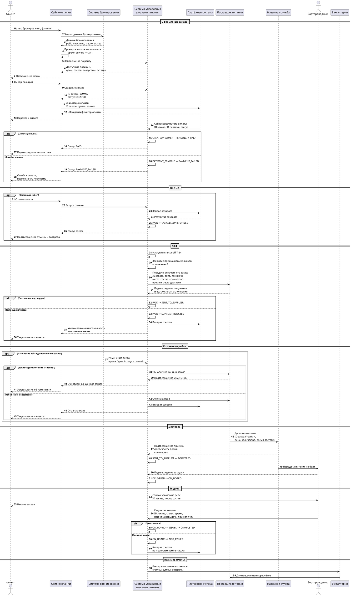
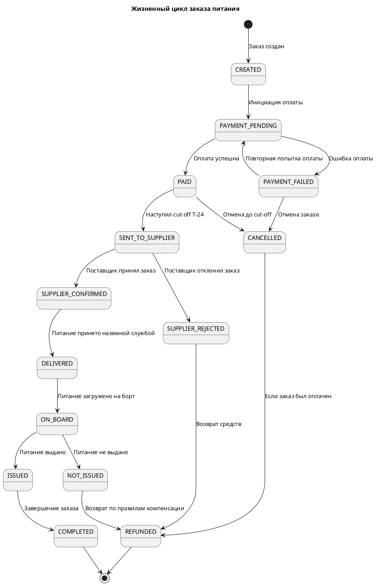

# Задача 1. «Заказ еды на борт»

В авиакомпании планируется ввести услугу «Заказ еды на борт».

Клиент компании через официальный сайт сможет приобрести еду и напитки, которые ему предоставит бортпроводник в процессе выполнения рейса.

Услугу можно будет приобрести не позднее чем за 24 часа до вылета.

Поставщиком еды будет сторонняя компания.

Поставщик получит заказ клиента и доставит его в аэропорт к установленному времени. Наземная служба обеспечит приём и передачу питания на борт.

Опишите предполагаемую схему взаимодействий участников данного бизнес-процесса после ввода услуги в эксплуатацию.

Какими данными должны обмениваться участники процесса и в какой момент времени?

## 1.1. Участники

| Участник | Роль |
|---|---|
| Клиент (пассажир) | Выбирает, оформляет и оплачивает заказ |
| Сайт авиакомпании | Предоставляет интерфейс для проверки бронирования, выбора питания, оформления заказа и отображения его статуса |
| Система бронирования | Предоставляет данные о бронировании, пассажире и рейсе; сообщает об изменениях рейса |
| Система управления заказами питания | Создаёт и хранит заказы, контролирует сроки, статусы, оплату и взаимодействие с поставщиком |
| Платёжная система | Обрабатывает платежи и возвраты |
| Поставщик питания | Получает заказ, подтверждает возможность его исполнения, комплектует и доставляет питание |
| Наземная служба | Принимает питание в аэропорту, проверяет количество и обеспечивает передачу на борт |
| Бортпроводник | Получает информацию о заказах и выдаёт питание пассажирам |
| Бухгалтерия | Получает данные о выполненных заказах для взаиморасчётов с поставщиком |

## 1.2. Основной сценарий

1. Клиент на сайте авиакомпании вводит номер бронирования и фамилию.
2. Сайт запрашивает данные бронирования в системе бронирования.
3. Система бронирования проверяет наличие бронирования, пассажира и рейса и возвращает необходимые данные.
4. Сайт проверяет возможность оформления услуги: до планового времени вылета должно оставаться не менее 24 часов.
5. Сайт запрашивает в системе управления заказами питания доступное меню для данного рейса.
6. Клиент выбирает еду и напитки.
7. Сайт передаёт выбранные позиции в систему управления заказами питания.
8. Система управления заказами создаёт заказ со статусом `CREATED`, рассчитывает стоимость и возвращает идентификатор заказа.
9. Клиент инициирует оплату.
10. Система управления заказами передаёт запрос в платёжную систему.
11. Платёжная система обрабатывает платеж и асинхронно передаёт результат оплаты.
12. При успешной оплате заказ переводится в статус `PAID`. При ошибке оплаты — в `PAYMENT_FAILED`, после чего клиент может повторить оплату.
13. После успешной оплаты система управления заказами подтверждает заказ клиенту.
14. До наступления контрольного времени T−24 часа заказ может быть отменён в соответствии с правилами возврата.
15. В момент наступления T−24 часа приём новых заказов и изменений закрывается. Оплаченные заказы передаются поставщику.
16. Поставщик подтверждает получение заказа и возможность его исполнения.
17. Если поставщик не может выполнить заказ полностью или частично, система управления заказами уведомляет клиента и выполняет предусмотренный сценарий замены или возврата средств.
18. Поставщик комплектует заказ и доставляет питание в аэропорт к согласованному времени.
19. Наземная служба принимает питание, проверяет количество и фиксирует факт доставки.
20. Наземная служба передаёт питание на борт.
21. Бортпроводник получает список заказов на рейс с привязкой к пассажирам и местам.
22. В процессе выполнения рейса бортпроводник выдаёт питание пассажирам.
23. После выдачи бортпроводник фиксирует результат по каждому заказу: «выдан» или «не выдан» с причиной.
24. После завершения рейса система управления заказами формирует реестр выполненных и невыполненных заказов.
25. Данные передаются в бухгалтерию для взаиморасчётов с поставщиком.

## 1.3. Диаграмма последовательности

## 1.4. Какими данными обмениваются системы

| № | Момент | От → Кому | Данные |
|---|---|---|---|
| 1 | Начало оформления | Клиент → Сайт | Номер бронирования, фамилия |
| 2 | Проверка бронирования | Сайт → Система бронирования | Номер бронирования, фамилия |
| 3 | Ответ по бронированию | Система бронирования → Сайт | ID бронирования, ID пассажира, номер рейса, дата/время вылета, аэропорты, место, класс обслуживания, статус |
| 4 | Запрос меню | Сайт → Система заказов | ID рейса, дата/время вылета |
| 5 | Отображение меню | Система заказов → Сайт | ID позиции, название, описание, цена, состав, аллергены, доступное количество |
| 6 | Создание заказа | Сайт → Система заказов | ID бронирования, ID пассажира, ID рейса, место, выбранные позиции, количество |
| 7 | Ответ при создании | Система заказов → Сайт | ID заказа, сумма, валюта, статус |
| 8 | Инициация оплаты | Система заказов → Платёжная система | ID заказа, сумма, валюта, идентификатор операции |
| 9 | Результат оплаты | Платёжная система → Система заказов | ID платежа, ID заказа, статус, сумма, время операции, идентификатор транзакции |
| 10 | Подтверждение заказа | Система заказов → Сайт | ID заказа, состав, сумма, рейс, место, статус |
| 11 | Передача поставщику | Система заказов → Поставщик | ID заказа, номер рейса, дата/время вылета, аэропорт, место пассажира, состав и количество позиций, специальные требования, время и место доставки |
| 12 | Подтверждение поставщика | Поставщик → Система заказов | ID заказа, статус принятия, время подтверждения, причина отказа при наличии |
| 13 | Изменение рейса | Система бронирования → Система заказов | ID рейса/бронирования, новый статус, новая дата/время, аэропорт, сведения об изменении самолёта |
| 14 | Изменение заказа | Система заказов → Поставщик | ID заказа, новые данные рейса, изменённый состав/количество либо признак отмены |
| 15 | Доставка | Поставщик → Наземная служба | ID заказа/партии, рейс, состав и количество питания, идентификатор груза, плановое время доставки |
| 16 | Подтверждение приёмки | Наземная служба → Система заказов | ID заказа/партии, статус, фактическое время, фактически принятое количество |
| 17 | Передача на борт | Наземная служба → Бортпроводник | Рейс, список заказов, ID заказов, места, состав и количество |
| 18 | Выдача | Бортпроводник → Система заказов | ID заказа, статус «Выдан» / «Не выдан», причина невыдачи, время выдачи |
| 19 | После завершения рейса | Система заказов → Бухгалтерия | Реестр заказов, статусы выполнения, суммы заказов, суммы возвратов |
| 20 | Взаиморасчёты | Бухгалтерия → Поставщик | Реестр выполненных заказов, сумма к оплате, данные для сверки |

## 1.5. Статусы заказа

### Правила переходов

- `CREATED` — заказ создан, но оплата ещё не завершена.
- `PAYMENT_PENDING` — ожидается результат оплаты.
- `PAID` — оплата успешно подтверждена.
- `PAYMENT_FAILED` — оплата завершилась ошибкой; разрешена повторная попытка.
- `CANCELLED` — заказ отменён до передачи поставщику.
- `SENT_TO_SUPPLIER` — заказ передан поставщику.
- `SUPPLIER_CONFIRMED` — поставщик подтвердил возможность исполнения.
- `SUPPLIER_REJECTED` — поставщик не может выполнить заказ.
- `DELIVERED` — питание принято наземной службой.
- `ON_BOARD` — питание загружено на борт.
- `ISSUED` — питание выдано пассажиру.
- `NOT_ISSUED` — питание не выдано; причина фиксируется.
- `COMPLETED` — заказ успешно исполнен.
- `REFUNDED` — по заказу выполнен возврат денежных средств.

При необходимости можно дополнительно хранить отдельные статусы оплаты, доставки и выдачи, чтобы не перегружать жизненный цикл заказа техническими состояниями.

## 1.6. Ключевые решения и допущения

- Заказ можно оформить не позднее чем за 24 часа до планового времени вылета.
- После наступления T−24 новые заказы и изменения существующих заказов не принимаются.
- Заказ связан с конкретным бронированием, пассажиром и рейсом.
- Передача заказа поставщику выполняется только после успешной оплаты.
- Для заказа используется уникальный `order_id`, позволяющий идентифицировать заказ и предотвращать его дублирование.
- Результат оплаты передаётся в систему управления заказами через callback от платёжной системы.
- Повторный callback по одной операции не должен приводить к повторному изменению статуса или повторному начислению/возврату денежных средств.
- Поставщик должен подтвердить получение заказа и возможность его исполнения.
- При отказе поставщика клиенту предоставляется предусмотренный бизнес-правилами сценарий замены или возврата.
- При изменении рейса система управления заказами повторно проверяет возможность исполнения заказа. Если исполнение невозможно, заказ отменяется и выполняется возврат согласно правилам.
- При доставке фиксируются плановое и фактическое время, количество переданных комплектов и идентификатор заказа/партии.
- Бортпроводник должен видеть, какому пассажиру и на каком месте предназначен конкретный заказ.
- По каждому заказу фиксируется результат выдачи и причина невыдачи, если питание не было выдано.
- Для каждого изменения статуса хранятся время изменения и источник изменения.
- Для интеграций используется уникальный идентификатор заказа, а операции оплаты и возврата должны быть идемпотентными.
- Взаиморасчёты с поставщиком выполняются на основании фактически выполненных заказов и согласованных правил расчёта.
