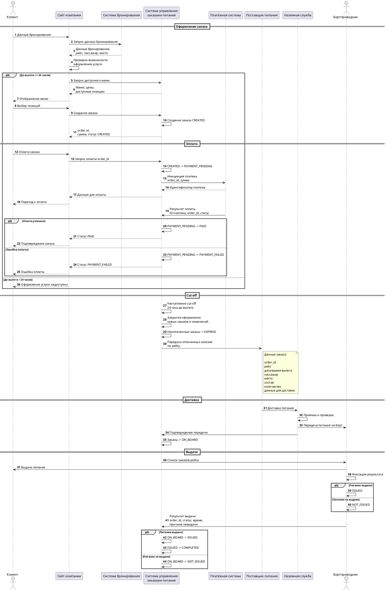
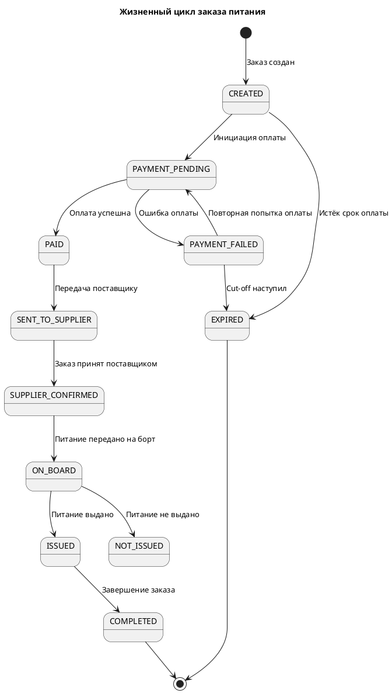

# Задача 1. «Заказ еды на борт»

В авиакомпании планируется ввести услугу «Заказ еды на борт».

Клиент компании через официальный сайт сможет приобрести еду и напитки, которые ему предоставит бортпроводник в процессе выполнения рейса. Услугу можно будет приобрести не позднее, чем за 24 часа до вылета.

Поставщиком еды будет сторонняя компания. Поставщик получит заказ клиента и доставит его на борт к времени вылета.

Необходимо описать предполагаемую схему взаимодействия участников бизнес-процесса после ввода услуги в эксплуатацию, а также определить данные, которыми должны обмениваться участники, и моменты такого обмена.

> **Допущения:** системы и участники, которые не указаны явно в исходном ТЗ, добавлены как предполагаемая модель реализации процесса. В частности, предполагается наличие системы управления заказами питания, системы бронирования, платёжной системы и наземной службы для передачи питания на борт.

---

## 1.1. Участники

| Участник                            | Роль                                                                                   |
| ----------------------------------- | -------------------------------------------------------------------------------------- |
| Клиент (пассажир)                   | Выбирает, оформляет и оплачивает заказ                                                 |
| Сайт авиакомпании                   | Интерфейс для оформления заказа и просмотра его статуса                                |
| Система бронирования                | Предоставляет данные о бронировании и рейсе                                            |
| Система управления заказами питания | Создаёт и хранит заказы, контролирует их статусы и взаимодействует с другими системами |
| Платёжная система                   | Проводит оплату заказа и возвраты                                                      |
| Поставщик питания                   | Получает заказы и доставляет питание на борт                                           |
| Наземная служба                     | Принимает питание от поставщика и обеспечивает его передачу на борт                    |
| Бортпроводник                       | Получает питание и выдаёт его пассажиру                                                |

---

## 1.2. Основной сценарий

### 1.2.1. Оформление и оплата заказа

1. Клиент вводит на сайте данные, необходимые для идентификации бронирования.

2. Сайт запрашивает данные бронирования в Системе бронирования.

3. Сайт получает данные о рейсе и пассажире и проверяет возможность оформления услуги.

4. Сайт запрашивает в Системе управления заказами питания доступные позиции меню.

5. Клиент выбирает необходимые позиции и передаёт заказ на оформление.

6. Система управления заказами питания создаёт заказ, рассчитывает итоговую сумму и присваивает ему уникальный `order_id`.

7. Клиент инициирует оплату.

8. Система управления заказами питания передаёт запрос в Платёжную систему.

9. Платёжная система возвращает результат оплаты.

10. При успешной оплате заказ получает статус `PAID`.

11. При ошибке оплаты заказ получает статус `PAYMENT_FAILED`. Клиент может повторить оплату, если срок оформления услуги ещё не истёк.

> Механизм callback и повторной проверки статуса платежа рассматривается как техническое решение интеграции с Платёжной системой.

---

### 1.2.2. Ограничение оформления услуги

12. Оформление новых заказов и изменение существующих заказов прекращается за 24 часа до планового времени вылета.

13. Неоплаченные заказы после наступления cut-off не передаются поставщику и могут быть переведены в статус `EXPIRED`.

14. После наступления cut-off в обработку передаются оплаченные заказы соответствующего рейса.

---

### 1.2.3. Передача заказа поставщику

15. Система управления заказами питания передаёт поставщику оплаченные заказы.

16. В передаваемых данных указываются:

* идентификатор заказа;
* данные рейса;
* дата и время вылета;
* аэропорт;
* пассажир и место;
* состав заказа;
* количество позиций;
* требования к доставке.

17. Поставщик принимает заказ и организует его комплектацию и доставку на борт к установленному времени.

> Формат передачи заказов поставщику — отдельными заказами или сгруппированными по рейсу — является архитектурным решением и в исходном ТЗ не определён.

---

### 1.2.4. Доставка на борт

18. Поставщик доставляет подготовленное питание в аэропорт и обеспечивает его передачу на борт к времени вылета.

19. В предлагаемой модели наземная служба принимает питание от поставщика и передаёт его экипажу.

20. Система управления заказами питания фиксирует факт передачи питания на борт.

21. Заказ получает статус `ON_BOARD`.

---

### 1.2.5. Выдача питания пассажиру

22. До вылета бортпроводнику передаётся список заказов рейса:

* `order_id`;
* пассажир;
* место;
* состав заказа;
* количество.

23. В процессе выполнения рейса бортпроводник выдаёт питание пассажиру.

24. По каждому заказу фиксируется результат выдачи:

* питание выдано;
* питание не выдано;
* причина невыдачи — при наличии.

25. После завершения рейса результат выдачи передаётся в Систему управления заказами питания.

26. Выданные заказы получают статус `ISSUED`, после чего могут быть переведены в `COMPLETED`.

27. Для невыданных заказов фиксируется соответствующий результат и причина.

> Правила возврата денежных средств за невыданный заказ в исходном ТЗ не определены и требуют отдельного бизнес-решения.

---

## 1.3. Изменение рейса и бронирования

Изменение рейса и бронирования не описано в исходном ТЗ, однако является возможным исключительным сценарием.

При наличии такой необходимости предполагается следующая схема:

1. Система бронирования сообщает Системе управления заказами питания об изменении рейса или бронирования.

2. Система управления заказами питания определяет, возможно ли исполнить заказ с учётом новых данных.

3. Если заказ может быть исполнен, обновлённые данные передаются поставщику.

4. Если заказ невозможно исполнить, дальнейшие действия определяются отдельными бизнес-правилами авиакомпании.

---

## 1.4. Диаграмма последовательности

---

## 1.5. Какими данными обмениваются системы

| №  | Момент                     | От → Кому                           | Данные                                                                             |
| -- | -------------------------- | ----------------------------------- | ---------------------------------------------------------------------------------- |
| 1  | Начало оформления          | Клиент → Сайт                       | Данные, необходимые для идентификации бронирования                                 |
| 2  | Проверка бронирования      | Сайт → Система бронирования         | Данные бронирования                                                                |
| 3  | Ответ по бронированию      | Система бронирования → Сайт         | ID бронирования, пассажир, рейс, дата/время вылета, место, статус                  |
| 4  | Запрос меню                | Сайт → Система заказов              | ID рейса, дата/время вылета                                                        |
| 5  | Меню                       | Система заказов → Сайт              | ID позиции, название, описание, цена, доступность                                  |
| 6  | Создание заказа            | Сайт → Система заказов              | ID бронирования, пассажир, рейс, место, выбранные позиции и количество             |
| 7  | Ответ при создании         | Система заказов → Сайт              | `order_id`, состав заказа, сумма, валюта, статус                                   |
| 8  | Инициация оплаты           | Система заказов → Платёжная система | `order_id`, сумма, валюта, идентификатор операции                                  |
| 9  | Результат оплаты           | Платёжная система → Система заказов | ID платежа, `order_id`, статус, сумма, время операции                              |
| 10 | Подтверждение заказа       | Система заказов → Сайт              | `order_id`, состав, сумма, рейс, место, статус                                     |
| 11 | Передача заказа поставщику | Система заказов → Поставщик         | ID заказа, рейс, дата/время вылета, аэропорт, пассажир, место, состав и количество |
| 12 | Подтверждение получения    | Поставщик → Система заказов         | ID заказа/заявки, статус получения, время                                          |
| 13 | Доставка                   | Поставщик → Наземная служба         | ID заказа/заявки, рейс, состав и количество, данные доставки                       |
| 14 | Подтверждение приёмки      | Наземная служба → Система заказов   | ID заказа/заявки, статус, фактическое время, фактически принятое количество        |
| 15 | Передача на борт           | Наземная служба → Бортпроводник     | Рейс, список заказов, места, состав и количество                                   |
| 16 | Список для выдачи          | Система заказов → Бортпроводник     | `order_id`, пассажир, место, состав, количество                                    |
| 17 | Результат выдачи           | Бортпроводник → Система заказов     | `order_id`, результат выдачи, время, причина невыдачи                              |

---

## 1.6. Статусы заказа

### Описание статусов

| Статус               | Значение                                                        |
| -------------------- | --------------------------------------------------------------- |
| `CREATED`            | Заказ создан, оплата ещё не завершена                           |
| `PAYMENT_PENDING`    | Ожидается результат оплаты                                      |
| `PAID`               | Оплата успешно подтверждена                                     |
| `PAYMENT_FAILED`     | Оплата завершилась ошибкой                                      |
| `EXPIRED`            | Заказ не был оплачен до окончания доступного времени оформления |
| `SENT_TO_SUPPLIER`   | Заказ передан поставщику                                        |
| `SUPPLIER_CONFIRMED` | Поставщик подтвердил получение заказа                           |
| `ON_BOARD`           | Питание передано на борт                                        |
| `ISSUED`             | Питание выдано пассажиру                                        |
| `NOT_ISSUED`         | Питание не выдано пассажиру                                     |
| `COMPLETED`          | Обработка заказа завершена                                      |

> В исходном ТЗ не определены конкретные статусы заказа. Данная статусная модель является предлагаемым решением.

---

## 1.7. Ключевые решения

* Заказ можно оформить не позднее чем за 24 часа до планового времени вылета.
* После наступления cut-off оформление новых заказов прекращается.
* Заказ связан с конкретным бронированием, пассажиром и рейсом.
* Для заказа используется уникальный `order_id`.
* Передача заказа поставщику выполняется после успешной оплаты.
* Поставщику передаются данные, необходимые для комплектации и доставки заказа на борт.
* Передача питания на борт фиксируется в Системе управления заказами.
* Бортпроводник получает список заказов рейса и фиксирует результат выдачи.
* Для каждого результата выдачи фиксируются заказ, результат и время операции.
* Конкретные правила возврата денежных средств при невыдаче, невозможности исполнения заказа, изменении или отмене рейса требуют отдельного бизнес-решения.
* Формат интеграции с Платёжной системой, включая callback и идемпотентность операций, является техническим решением.
* Конкретный формат передачи заказов поставщику — отдельными заказами или группировкой по рейсу — является архитектурным решением.
* Системы и участники, не указанные в исходном ТЗ, являются допущениями данной модели.
